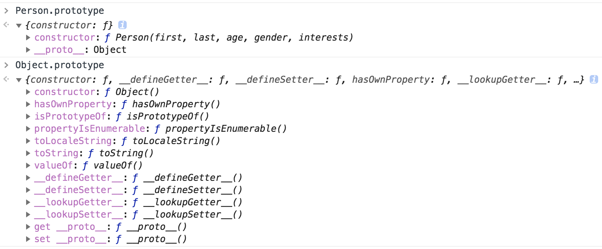
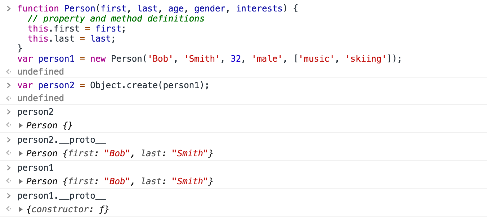
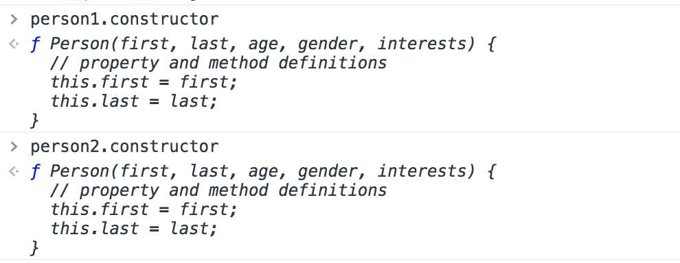

# Prototypes and prototype chains (原型与原型链)

这篇文章主要解决两个问题：
1. what’s prototype chains? and how prototype object chains allow objects to inherit features from one another?
(什么是原型链？以及原型对象链如何允许一个对象从另一个对象中继承其特性？)
2. what’s the prototype property? and how the prototype property can be used to add methods to existing constructors?
(原型属性是什么？以及如何使用原型属性向现有构造函数添加方法？)
 
## 定义
> JavaScript is often described as a prototype-based language — **each object has a prototype object**, which acts as a template object that it inherits methods and properties from. An object's prototype object may also have a prototype object, which it inherits methods and properties from, and so on. This is often referred to as a `prototype chain`, and explains why different objects have properties and methods defined on other objects available to them.

**To be exact, the properties and methods are defined on the prototype property on the Objects' constructor functions, not the object instances themselves.**

In JavaScript, a link is made between the object instance and its prototype (its `__proto__` property, which is derived from the prototype property on the constructor), and the properties and methods are found by walking up the chain of prototypes.

::: warning Note
It's important to understand that there is a distinction between an **object's prototype** (which is available via `Object.getPrototypeOf(obj)`, or via the deprecated __proto__ property) and **the prototype property on constructor functions**. The former is the property on each instance, and the latter is the property on the constructor. That is, `Object.getPrototypeOf(new Foobar())` refers to the same object as `Foobar.prototype`.
:::

## Understanding prototype objects
Let's look at an example to make this a bit clearer:
In this example, we have defined a constructor function, like so:
```js
function Person(first, last, age, gender, interests) {  
  // property and method definitions
  this.first = first;
  this.last = last;
}
```

We have then created an object instance like this:
```js
var person1 = new Person('Bob', 'Smith', 32, 'male', ['music', 'skiing']);
```

This demonstrates the prototype chain working.


So what happens if you call a method on person1, which is actually defined on Object?
For example:
```js
person1.valueOf()
```

This method simply returns the value of the object it is called on — try it and see! In this case, what happens is:
1. The browser initially checks to see if the `person1` object has a `valueOf()` method available on it.
2. It doesn't, so the browser then checks to see if the `person1 object's prototype object` (Person() constructor's prototype) has a `valueOf()` method available on it.
3. It doesn't either, so the browser then checks to see if the `Person() constructor's prototype object's prototype object `(Object() constructor's prototype) has a `valueOf()` method available on it. It does, so it is called, and all is good!

::: warning Note
There isn't officially a way to access an object's prototype object directly — the "links" between the items in the chain are defined in an internal property, referred to as `[[prototype]]` in the specification for the JavaScript language. Most modern browsers however do have a property available on them called `__proto__ `, which contains the object's constructor's prototype object. For example, try `person1.__proto__` and `person1.__proto__.__proto__` to see what the chain looks like in code!
:::

This demonstrates `person1.__proto__` and `person1.__proto__.__proto__` structure:


Since ECMAScript 2015 we can access an object's prototype object indirectly via `Object.getPrototypeOf(obj)`.


## The prototype property: Where inherited members are defined
我们可以在看到 [这里](https://developer.mozilla.org/en-US/docs/Web/JavaScript/Reference/Global_Objects/Object) 很多的 Object’s Methods.
为什么这些方法有些是可以被继承的，有些不可以被继承呢？

The answer is that **the inherited ones are the ones defined on the prototype property** (you could call it a sub-namespace) — that is, the ones that begin with `Object.prototype`., and not the ones that begin with just `Object`. 

The prototype property's value is an object, which is basically a bucket for storing properties and methods that we want to be inherited by objects further down the prototype chain.

So `Object.prototype.watch()`, `Object.prototype.valueOf()`, etc., are available to any object types that inherit from `Object.prototype`, including new object instances created from the constructor.

`Object.is()`, `Object.keys()`, and other members **not** defined inside the prototype bucket are **not** inherited by object instances or object types that inherit from `Object.prototype`. They are methods/properties available just on the `Object()`constructor itself.

So, maybe you will feel strange, **how can you have a method defined on a constructor, which is itself a function?** 
Well, a function is also a type of object — see the Function() constructor reference if you don't believe us.

1. You can check out existing prototype properties for yourself — go back to our previous example and try entering the following into the JavaScript console:
```js
Person.prototype
```

2. The output won't show you very much — after all, we haven't defined anything on our custom constructor's prototype! By default, a constructor's prototype always starts empty. Now try the following:
```js
Object.prototype
```



You'll see a large number of methods defined on **Object's prototype property**, which are then available on objects that inherit from Object, as shown earlier.

You'll see other examples of prototype chain inheritance all over JavaScript — try looking for the methods and properties defined on the prototype of the `String`, `Date`, `Number`, and `Array` global objects, for example. These all have a number of members defined on their prototype, which is why for example when you create a string, like this:
```js
var myString = 'This is my string.';
```
`myString` immediately has a number of useful methods available on it, like `split()`, `indexOf()`, `replace()`, etc.

## Revisiting create()
the `Object.create()` method can be used to create a new object instance.

For example, try this in your previous example's JavaScript console:
```js
var person2 = Object.create(person1);
```

**What `create()` actually does is to create a new object from a specified prototype object. Here, `person2` is being created using `person1` as a prototype object. You can check this by entering the following in the console:**
```js
person2.__proto__
```
This will return the `person1`.



## The constructor property
Properties defined on the **Person.prototype property** become available to all the instance objects created using the **Person() constructor**. Hence, the constructor property is also available to both `person1` and `person2` objects.

For example, try these commands in the console:
```js
person1.constructor
person2.constructor
// These should both return the Person() constructor, as it contains the original definition of these instances.
```


The constructor property has other uses. For example, if you have an object instance and you want to return the name of the constructor it is an instance of, you can use the following:
```js
person1.constructor.name
// return "Person"
```
::: warning Note
The value of `constructor.name` can change (due to prototypical inheritance, binding, preprocessors, transpilers, etc.), so for more complex examples you'll want to use the `instanceof` operator instead. 
:::

## Modifying prototypes
**Question: how the prototype property can be used to add methods to existing constructors?**

很简单，直接添加到`constructors` 的`prototype`上即可，例如：
```js
Person.prototype.farewell = function() {
  alert(this.first + ' has left the building. Bye for now!');
};
```
这样便可以在 `Person` 的 `prototype` 上新增方法 `farewell`。

::: tip
In fact, a fairly common pattern for more object definitions is to **define the properties inside the constructor, and the methods on the prototype.** This makes the code easier to read, as the constructor only contains the property definitions, and the methods are split off into separate blocks.
:::
Like This:
```js
// Constructor with property definitions
function Test(a, b, c, d) {
  // property definitions
}

// First method definition
Test.prototype.x = function() { ... };

// Second method definition
Test.prototype.y = function() { ... };

// etc.
```

## 参考资料
[Object prototypes - Learn web development | MDN](https://developer.mozilla.org/en-US/docs/Learn/JavaScript/Objects/Object_prototypes)