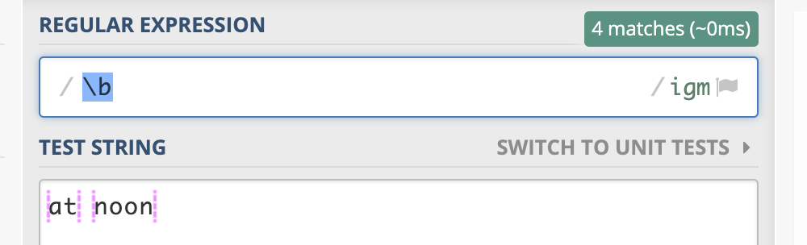
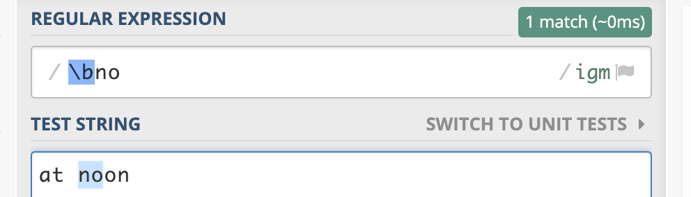
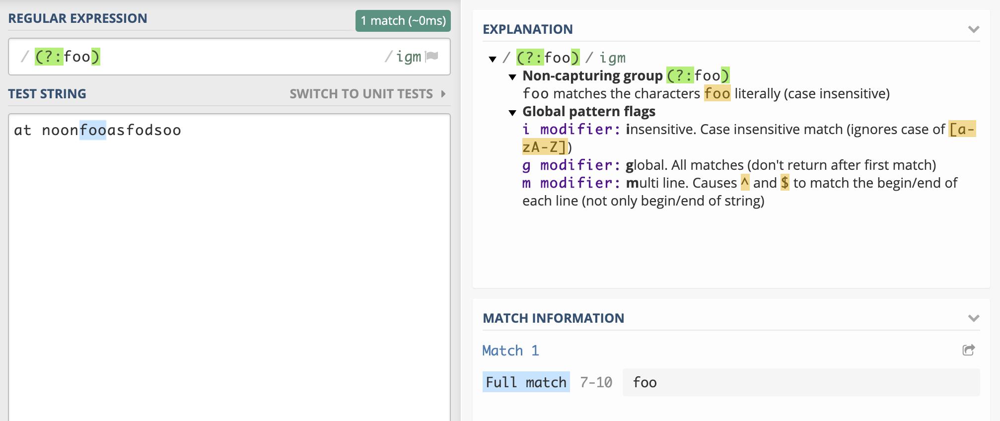
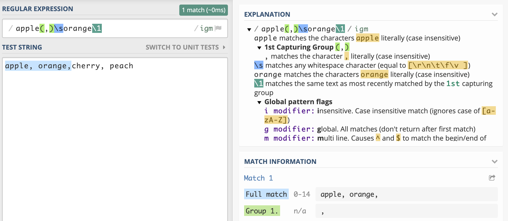
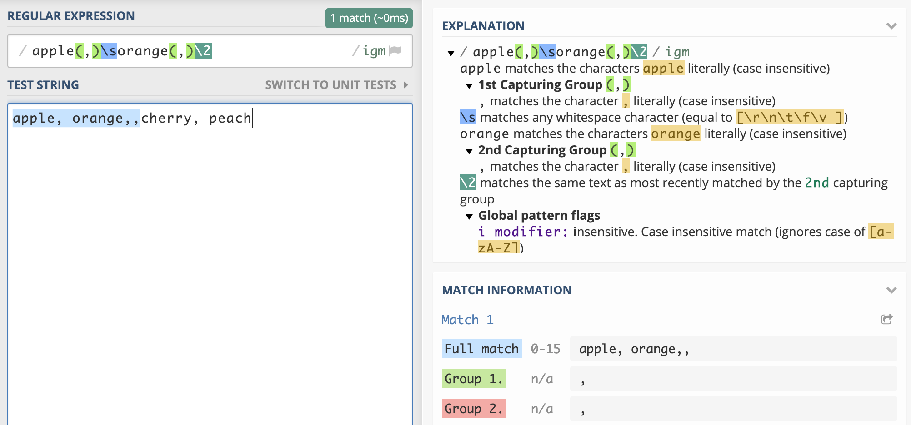

# 正则表达式

## 在线工具

[regex101](https://regex101.com/)

regex101 支持在正则表达式的不同 flavor 之间切换、解释你的正则表达式、显示匹配信息、提供常用语法参考等功能，非常强大。

[regexr](https://regexr.com/)

## 基础

在 Javascript 中，一个正则表达式以 `/` 开头和结尾，所以 `/hello regexp/` 就是一个正则表达式。

### Flags（标志符或修饰符）

Flags 写在结束的`/`之后，可以影响整个正则表达式的匹配行为。常见的 flags 有：

1.  `g`：全局匹配（global）；正则表达式默认只会返回第一个匹配结果，使用标志符 g 则可以返回所有匹配。
2.  `i`：忽略大小写（case-insensitive）；在匹配时忽略英文字母的大小写。
3.  `m`：多行匹配（multiline）；将开始和结束字符（^和\$）视为在多行上工作，即分别匹配每一行（由 \n 或 \r 分割）的开始和结束，而不只是只匹配整个输入字符串的最开始和最末尾处。

所有的 flags 都打上的话，那就是`/^*$/gimsuy`：


### Character Sets（字符集合）

用于匹配字符集合中的任意一个字符。

1. `[xyz]`：匹配 `x`或`y`或`z`。
2. `[^xyz]`：补集，匹配除了 `x` `y` `z`的其他字符。
3. `[a-z]`：匹配从 `a` 到 `z` 的任意字符。
4. `[^a-n]`：补集，匹配除了 `a` 到 `n` 的其他字符。
5. `[A-Z]`：匹配从 `A` 到 `Z` 的任意字符。
6. `[0-9]`：匹配从 `0` 到 `9` 的任意数字。

匹配所有的字母和数字可写成：`/[a-zA-Z0-9]/` 或者 `/[a-z0-9]/i`。

### Quantifiers (量词)

使用 Quantifiers 来实现重复匹配。

1. `{n}`：匹配 `n` 次。
2. `{n,m}`：匹配 `n到m` 次。
3. `{n,}`：匹配 `>=n` 次，即`大于n`次。
4. `?`：匹配 `0 || 1` 次，即 `0或者1` 次。
5. `*`：匹配 `>=0` 次，等价于 `{0,}`。
6. `+`：匹配 `>=1` 次，等价于 `{1,}`。

如字段`abczzzzzzzxyabcabcabc`，使用`/z*xy/gi`，会匹配出`zzzzzzzxy`；

使用`/z{0,2}xy/gi`，会匹配出`zzxy`；

### Metacharacters（元字符）

在正则表达式中有一些具有特殊含义的字母，被称为元字符，简言之，元字符就是描述字符的字符，它用于对字符表达式的内容、转换及各种操作信息进行描述。

常见的元字符有：

1. `\d`：匹配任意数字，等价于 `[0-9]`。
2. `\D`：匹配任意非数字字符；`\d` 的补集。
3. `\w`：匹配任意基本拉丁字母表中的字母和数字，以及下划线；等价于 `[A-Za-z0-9_]`。
4. `\W`：匹配任意非基本拉丁字母表中的字母和数字，以及下划线；`\w` 的补集。
5. `\s`：匹配一个空白符，包括空格、制表符、换页符、换行符和其他 Unicode 空格。
6. `\S`：匹配一个非空白符；`\s` 的补集。
7. `\b`：匹配一个零宽单词边界，如一个字母与一个空格之间；例如，`/\bno/`匹配 `at noon` 中的 `no`，`/ly\b/` 匹配 `possibly yesterday.` 中的 `ly`。
8. `\B`：匹配一个零宽非单词边界，如两个字母之间或两个空格之间；例如，`/\Bon/` 匹配 `at noon` 中的 `on`，`/ye\B/` 匹配 `possibly yesterday.` 中的 `ye`。
9. `\t`：匹配一个水平制表符（tab)。
10. `\n`：匹配一个换行符（newline)。
11. `\r`：匹配一个回车符（carriage return)。

#### 理解`\b 零宽单词边界`

我们看以下的匹配：


上图中，紫红色竖线表示的位置就是零宽单词边界（Matches a zero-width word boundary），说白了，就是一个字母的两侧是否有空格，我们输入内容，就知道匹配的是什么了：


### Special Characters (特殊字符)

正则中存在一些特殊字符，它们不会按照字面意思进行匹配，而有特殊的意义，比如前文讲过用于量词的`?`、`*`、`+`。

其他常见的特殊字符有：

1. `\`：转义字符，可以将普通字符转成特殊字符。比如`\w`；也可以将特殊字符转成字面意思，比如 `\+` 匹配 `+`。
2. `.`：匹配任意单个字符，但是换行符除外：`\n`, `\r`, `\u2028` 或 `\u2029`；在字符集中`[.]`，无特殊含义，即表示 `.` 的字面意思。
3. `|`：替换字符（alternate character），匹配 `|` 前或后的表达式。比如需要同时匹配 `bear` 和 `pear`，可以使用 `/(b|p)ear/` 或者 `/bear|pear/`；但是不能用 `/b|pear/`，该表达式只能匹配 `b` 和 `pear`。
4. `^`：匹配输入的开始。比如，`/^A/` 不匹配 `an Apple` 中的 `A`，但匹配 `An apple` 中的 `A`。
5. `$`：匹配输入的结尾。比如，`/t$/` 不匹配 `eater` 中的 `t`，但匹配 `eat` 中的 `t`。

`^` 和 `$` 在表单验证时常需要使用，因为需要验证从开始到结尾的一个完整输入，而不是匹配输入中的某一段。

### Groups（分组）

1. `(xyz)`：捕获分组（Capturing Group），匹配并捕获匹配项；例如，`/(foo)/` 匹配且捕获 `foo bar.` 中的 `foo`。

被匹配的子字符串可以在结果数组的元素 `[1], ..., [n]` 中找到，或在被定义的 RegExp 对象的属性 `$1, ..., $9` 中找到。

2. `(?:xyz)`：非捕获分组（Non-capturing Group），匹配但不会捕获匹配项；匹配项不能再次被访问到。
3. `\n`：n 是一个正整数，表示反向引用（back reference），指向正则表达式中第 n 个括号（从左开始数）中匹配的子字符串；例如，`/apple(,)\sorange\1/` 匹配 `apple, orange, cherry, peach.` 中的 `apple, orange,`。

---

#### 我们来理解一下：“非捕获分组（Non-capturing Group）”是什么意思？

先执行如下代码：

```js
var string = "at noonfooasfodsoo";
var regex = /(foo)/gi;
var c1 = regex.exec(string);
var regex1 = /(?:foo)/gi;
var c2 = regex1.exec(string);
```

看看输出结果`c1`和`c2`值的区别：


返回的数组中少了`[1]`的内容，我们到 regex101 上去也看看区别：


所以使用`(?:xyz)`，意思是匹配并但不会捕获匹配项到 Group 中。

---

#### 我们再来理解什么是“反向引用（back reference）”

如上例，`/apple(,)\sorange\1/`中的`\1`指的其实就是`(,)`，这个表达式等同的写法是`/apple(,)\sorange(,)/`


我们试试`\2`，也就是等价于左数第二个括号中的内容，看看匹配到的内容，我们在文本内容中再多加一个`,`：


### Assertion（断言）
1. `x(?=y)`：仅匹配被y跟随的x；

例如，`/bruce(?=wayne)/`，如果`bruce`后面跟着`wayne`，则匹配`bruce`。

`/bruce(?=wayne|banner)/`，如果`bruce`后面跟着`wayne`或者`banner`，则匹配`bruce`。

`wayne` 和 `banner` 都不会在匹配结果中出现。

2. `x(?!y)`：仅匹配不被y跟随的x；

例如，`/\d+(?!\.)/` 只会匹配不被 "." 跟随的数字。

`/\d+(?!\.)/.exec('3.141')` 匹配 `141`，而不是 `3.141`

## 参考文章
[segmentfault](https://segmentfault.com/a/1190000018489883)