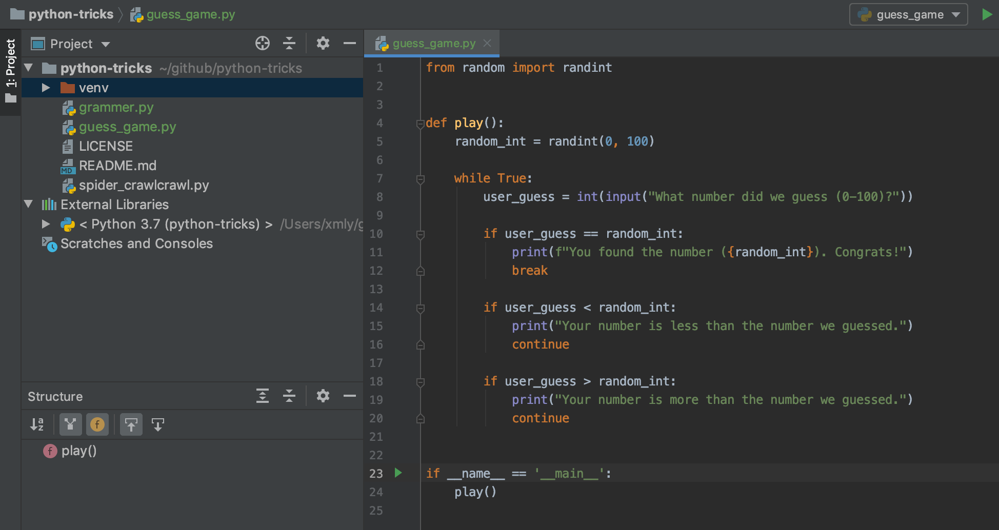

# Python环境配置 - OSX
##  安装Python3
Mac OSX自带Python2.7版本，而我们需要更新的版本去实践开发。

前提：安装好Xcode，然后是homebrew（以上安装步骤省略），使用`brew`命令去安装python最简单。

安装前确认下安装包的名字：
```bash
##  可以对homebrew库进行搜索
brew search python
```

命令行运行，安装python3：
```bash
##  Python3的版本
brew install python3
```

Python3 會被安裝在`/usr/local/Cellar`目录，在这个目录下还可以看到其他用brew安装的包。


安装好后可以运行以下命令查看Python版本：
```bash
##  系统python2的版本
python -V
##  python3的版本
python3 -V
```

以下这个命令可以查看python命令的系统路径：
```bash
which python
##  输出：/usr/local/bin/python

which python3
##  输出：/usr/local/bin/python3
```

另外，系统自带的Python2.7的路径是：`/usr/bin/python`

**参考资料：[Mac OSX 正确的同時安裝 Python 2.7 和 Python3](https://stringpiggy.hpd.io/mac-osx-python3-dual-install/#step4)**

##  修改Pycharm中默认使用 Python2.7 为Python3
到 Preferences 中，修改 Project Interpreter，选择到Python3的对应包即可。


第一个Python3的项目程序 : )


##  Anaconda 安装
[清华大学开源软件镜像站](https://mirror.tuna.tsinghua.edu.cn/help/anaconda/) 速度较快。

##  可视化工具


