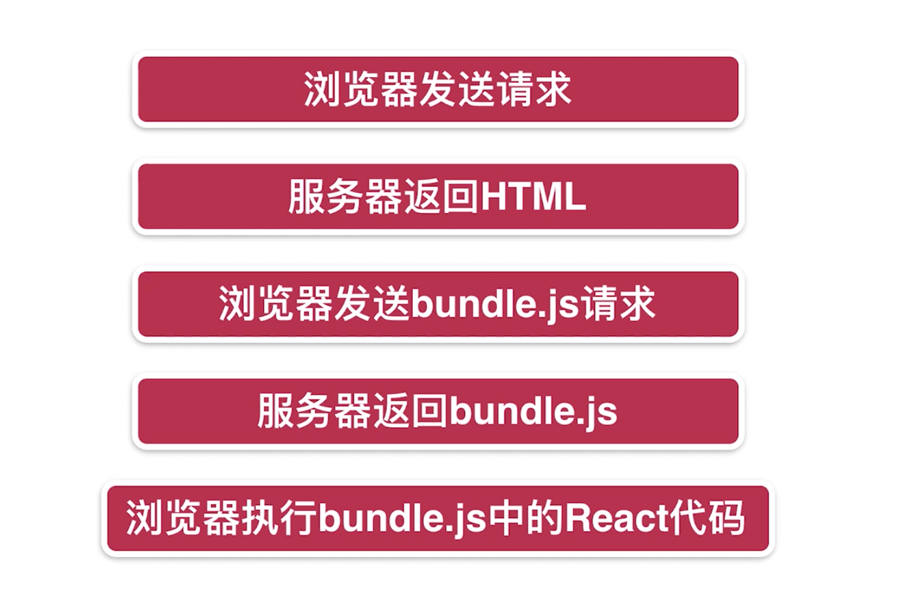
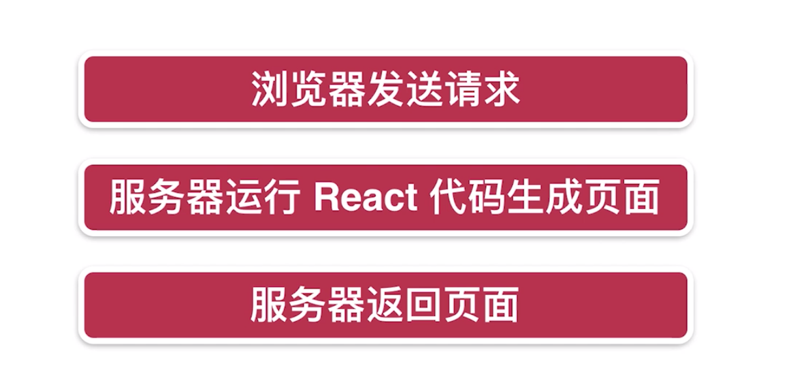
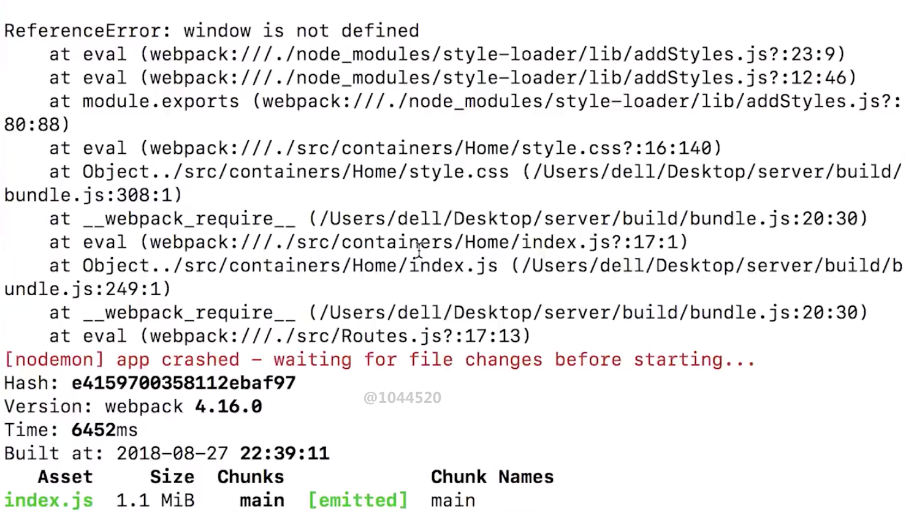
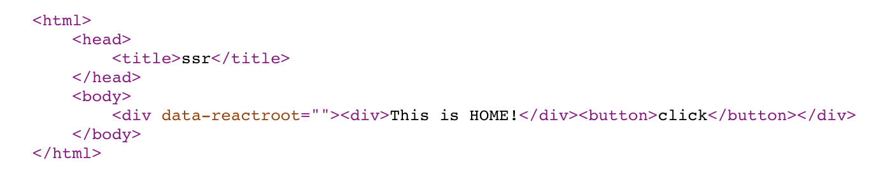
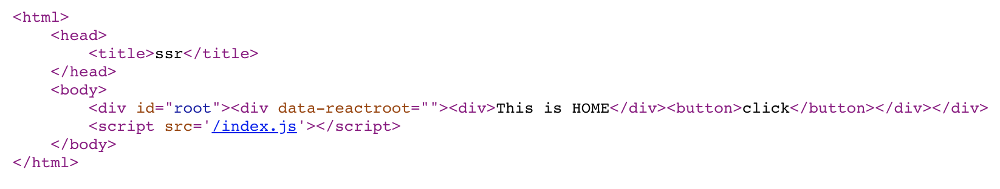
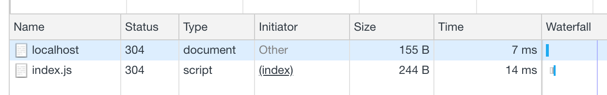

# 从 0 实现 React SSR

## 什么是服务端渲染？
SSR：服务器把页面要展示的内容提前渲染好，直接返回给客户端去展示。

SSR 缺点：很消耗服务器的性能。

CSR（Client Server Render）客户端渲染：由客户端来渲染页面内容。

CSR 缺点：TTFP首屏展现时间慢，对 SEO 不友好。 


CSR 首屏渲染时间不如 SSR。

CSR 的 SEO 效果不如 SSR。（因为爬虫只能读取到 html 中的文本内容，读取不到 JS 里的内容，而 CSR 是由 JS 执行后渲染页面内容。）

## 在服务器端编写 React 组件
用 React 进行的客户端渲染，页面访问的执行顺序。


在服务器端写 React ，页面访问的执行顺序。


Node 环境下不遵从 **ESModule** 的写法，而遵从 **common.js** 的写法。
所以不能写
```jsx
import React from 'react'; 
const Home = () => {
    return <div>home</div>
}
export default App;
```

而是要 **common.js** 的写法：
```jsx
const React = require('react');
// 需要 webpack 编译打包好 JSX 语法内容才能用
const Home = () => {
    return <div>home</div>
}
module.exports = {
    default: Home
}
```
但我们可以通过 webpack 编译打包，来使我们依然使用 **ESModule** 的写法。
## 编写 webpack 4 的配置文件
webpack cli: [https://github.com/webpack/webpack-cli](https://github.com/webpack/webpack-cli)
### Babel
```jsx
server/webpack.server.js
const path = require('path');
const nodeExternals = require('webpack-node-externals');

module.exports = {
    // 指定target是node环境，原因是例如const path = require('path');
    // 在node环境下不会将整个包全部引入，而在客户端环境会将整个包全部引入。
    // 所以需要声明。
    target: 'node',
    // webpack4要求要声明mode环境
    mode: 'development',
    entry: './src/index.js',
    output: {
        filename: 'bundle.js',
        // __dirname 指的是服务器端的根路径
        // 打包后的文件放到根路径下的 build 文件夹
        path: path.resolve(__dirname, 'build')
    },
    // 
    externals: [nodeExternals()],
    module: {
        rules: [{
            test: /\.js?$/,
            // 要使用 babel-loader，还需要安装它的核心库 babel-core
            // npm install babel-loader babel-core --save
            loader: 'babel-loader',
            exclude: /node_modules/,
            options: {
            // 需要安装babel-preset-react来使得babel-loader能编译react代码
            // babel-preset-stage-0,babel-preset-env是辅助编译react的
            // 都需要安装
                presets: ['react', 'stage-0', ['env', {
                    // 打包编译时，babel会去兼容所有主流浏览器的最后两个版本
                    targets: {
                        browsers: ['last 2 versions']
                    }
                }]]
            }
        }]
    }
}
```

使用下面这条命令，使webpack用我们指定的配置文件进行打包。
```bash
$ webpack --config webpack.server.js
```

运行可能会报如下警告：

在服务器端打包的策略和客户端不同，所以要安装 **webpack-node-externals** ，使得代码中引入的第三方的 node modules 不被打包进bundled.js 里（如koa，express这样的库）。

文档：[https://github.com/liady/webpack-node-externals](https://github.com/liady/webpack-node-externals)

### CSS
webpack css 客户端打包编译需要安装 style-loader 和 css-loader。
```bash
yarn add style-loader css-loader
```

在服务器渲染时，使用style-loader会报以下错误，因为服务端上没有window对象。


所以服务端渲染时，CSS 打包使用 isomorphic 来代替 style-loader。
[https://github.com/kriasoft/isomorphic-style-loader](https://github.com/kriasoft/isomorphic-style-loader)

分别配置客户端和服务端的webpack文件：
```js
// server/webpack.client.js
const clientConfig = {
	mode: 'development',
	entry: './src/client/index.js',
	output: {
		filename: 'index.js',
		path: path.resolve(__dirname, 'public')
	},
	module: {
		rules: [{
			test: /\.css?$/,
			use: ['style-loader', {
				loader: 'css-loader',
				options: {
					importLoaders: 1,
					modules: true,
					localIdentName: '[name]_[local]_[hash:base64:5]'
				}
			}]
		}]
	}
};
```

```jsx
// server/webpack.server.js
const serverConfig = {
	target: 'node',
	mode: 'development',
	entry: './src/server/index.js',
	output: {
		filename: 'bundle.js',
		path: path.resolve(__dirname, 'build')
	},
	externals: [nodeExternals()],
	module: {
		rules: [{
			test: /\.css?$/,
			use: ['isomorphic-style-loader', {
				loader: 'css-loader',
				options: {
					importLoaders: 1,
					modules: true,
					localIdentName: '[name]_[local]_[hash:base64:5]'
				}
			}]
		}]
	}
};
```

但是这种做法也只是可以成功打包在服务端渲染时的 CSS 代码，页面上显示的还是客户端渲染的 CSS。想要服务端渲染时就把 CSS 代码打包好，参考下方的小节内容：**处理SSR框架中的CSS样式-  实现CSS样式的服务器端渲染。**

### Webpack 的自动打包与服务器自动重启
nodemon is a tool that helps develop node.js based applications by automatically restarting the node application when file changes in the directory are detected.

全局安装：
```bash
yarn global add nodemon
```
文档：[https://github.com/remy/nodemon](https://github.com/remy/nodemon)

配置新命令：
server/package.json
```json
"scripts": {
  "start": "nodemon --watch build --exec node \"./build/bundle.js\"",
  "build": "webpack --config webpack.server.js --watch"
},
```

webpack 命令追加 `--watch` 参数，意思是监听 webpack.server.js 配置的文件的变化，一旦发生变化就重新build打包一次代码。但是这只是重新打包了新的 bundled.js，并没有重启服务器，所以页面显示的还是旧的内容。所以我们需要配合着 nodemon 来使用。

start 命令的意思是 nodemon 监听 build 文件夹，一旦 build 文件夹发生了更改，就执行`node "./build/bundle.js"`命令，重启服务器。

### npm-run-all
上面自动打包和服务器自动重启是两条命令，需要两个终端窗口去分别执行，太麻烦，我们可以借助第三方工具使之合并为一个命令。

**全局安装 npm-run-all**
```bash
yarn global add npm-run-all
```
文档：[https://github.com/mysticatea/npm-run-all](https://github.com/mysticatea/npm-run-all)

改写命令，`npm-run-all --parallel dev:**` 的意思是，并行的执行所有以 dev: 开头的命令。
```json
"scripts": {
  "dev": "npm-run-all --parallel dev:**",
  "dev:start": "nodemon --watch build --exec node \"./build/bundle.js\"",
  "dev:build": "webpack --config webpack.server.js --watch"
},
```

### webpack-merge 优化
可以用 webpack-merge 去合并webpack中重复的配置项。
```js{31}
// server/webpack.server.js
const path = require('path');
const nodeExternals = require('webpack-node-externals');
const merge = require('webpack-merge');
const config = require('./webpack.base.js');

const serverConfig = {
	target: 'node',
	mode: 'development',
	entry: './src/server/index.js',
	output: {
		filename: 'bundle.js',
		path: path.resolve(__dirname, 'build')
	},
	externals: [nodeExternals()],
	// ...
};

module.exports = merge(config, serverConfig);
```
./webpack.base.js 导出一个对象，merge 方法去合并 config 对象和 serverConfig 对象。

## 实现服务器端组件渲染
原来客户端渲染的模式：
```jsx
import React from 'react';
import ReactDOM from 'react-dom';
import App from './App';

ReactDOM.render(<App />, document.getElementById('root'));
```
在服务器端并不能直接 ReactDOM.render() 去取节点渲染。

但react-dom提供了服务器端渲染的方法：**renderToString**
```jsx{6,9,18}
// server/src/index.js
import express from 'express';
import Home from './containers/Home';
import React from 'react';
// 在服务器端渲染 react 组件
import { renderToString } from 'react-dom/server';

const app = express();
const content = renderToString(<Home />);

app.get('/', function (req, res) {
  res.send(`
		<html>
			<head>
				<title>ssr</title>
			</head>
			<body>
				${content}
			</body>
		</html>
  `);
});

var server = app.listen(3000);
```
**React 的虚拟 DOM 使得服务器渲染更简单，它是建立在虚拟DOM上的服务器端渲染，就是一个 JS 对象(虚拟DOM)转成字符串返回去。**

## 同构的概念梳理
### 什么是同构？
一套React代码，在服务器端执行一次，在客户端再执行一次。


### 为什么要有同构？
假如我们想点击button时执行绑定在上面的 JS 语句，但服务器渲染时，组件上绑定的 JS 语句返回给客户端时会被删掉。

```jsx{8}
// server/src/containers/Home/index.js
import React from 'react';

const Home = () => {
  return (
    <div>
      <div>This is HOME!</div>
      <button onClick={()=>{alert('click1')}}>
        click
      </button>
    </div>
  )
}

export default Home;
```

```jsx
// server/src/index.js
import express from 'express';
import React from 'react';
import { renderToString } from 'react-dom/server';
import Home from '../containers/Home';

const app = express();
app.use(express.static('public'));

const content = renderToString(<Home />);

app.get('/', function (req, res) {
  res.send(`
		<html>
			<head>
				<title>ssr</title>
			</head>
			<body>
				<div id="root">${content}</div>
			</body>
		</html>
  `);
});

var server = app.listen(3000);
```

如上面 button 的 alert 语句，渲染到页面时已被删除。


为了解决这个问题，提出同构这种做法。
### 如何在浏览器上执行一段 JS 代码？

```jsx
const app = express();
app.use(express.static('public'));
```

使用 use() 使用中间件，`express.static('public')` 意思是假如访问的是一个静态文件，就会到根目录下的public文件夹去获取资源。我们在webpack配置了客户端的文件会被打包到public文件夹下，这样就有了解决的一种方式：
```jsx{10}
// ...
app.get('/', function (req, res) {
  res.send(`
		<html>
			<head>
				<title>ssr</title>
			</head>
			<body>
				<div id="root">${content}</div>
				<script src='/index.js'></script>
			</body>
		</html>
  `);
});
// ...
```
同构过程：访问 localhost:3000，可以获得服务器端渲染的内容，然后进行客户端的渲染。

在页面中的 `<script src='/index.js'></script>` 会引入index.js文件，并且执行里面的JS内容。 


### 让 React 代码在浏览器上运行
根据上面的同构思路，我们在src目录下新建一个client目录，专门存放客户端要执行的代码js 文件，并且用 webpack 打包编译到 public 文件夹下，使在浏览器中访问打包后的server/src/client/index.js 文件（浏览器里是不直接支持esmodule的写法的）。

客户端代码，在服务端渲染后吐给浏览器后，客户端渲染时加载的内容，重新加载了一次组件Home。
```jsx
// server/src/client/index.js
import React from 'react';
import ReactDom from 'react-dom';

import Home from '../containers/Home';

ReactDom.hydrate(<Home />, document.getElementById('root'))
```

这时候服务器渲染出的内容里，button上依然是没有js语句的，但是客户端渲染时加载的index.js 文件，同构，使得 button 上的 click 语句正常执行了。


我们可以看到浏览器请求的先是服务器端返回的 localhost html，然后再请求加载的 index.js：


## 在SSR框架中引入路由机制
客户端的路由机制：


服务器端路由机制：
同构，在客户端的路由机制是一样的。但是在服务器端就不一样了。
最大的区别是服务器端使用 **StaticRouter** ，而客户端使用 **BrowserRouter **。
文档：[https://reacttraining.com/react-router/web/api/StaticRouter](https://reacttraining.com/react-router/web/api/StaticRouter)

安装react路由：
```bash
yarn add react-router-dom
```

路由配置文件：
server/src/Routes.js


/server/src/client/index.js

客户端使用 BrowserRouter 进行客户端路由渲染。

server/src/server/index.js

服务器端express监听所有路由路径，并且把要渲染的内容封装成一个render方法（优化策略）。
req 是 express 监听到路由变更时的一个大对象，其中 req.path 是当前url的 pathname。

server/src/server/utils.js

render 方法中使用 StaticRouter 进行服务器端路由渲染。
context 传递一个对象来通信。官方解释：A plain JavaScript object. During the render, components can add properties to the object to store information about the render. When a `<Route>` matches, it will pass the context object to the component it renders as the staticContext prop.

**服务器端渲染只发生在我们第一次进入页面的时候，之后页面由 React 代码接管，路由跳转都是客户端控制的，不会重新请求页面。**
## SSR框架与Redux的结合

### 同构项目中引入 Redux
server/src/store/index.js


为什么 store 返回是以一个 getStore() 函数的方式？
涉及到**单例**的问题，在服务器端直接返回一个 store 对象的话，那众多浏览器在访问的时候，都是读取的这一个对象，对服务器压力会很大。而返回一个函数的方式，使得 store 对象是在客户端生成，即多例的运用。

客户端引入
server/src/client/index.js


服务器端引入
server/src/server/utils.js


### 构建 Redux 代码结构
省略... 优化redux的工程目录。

**流程回顾：**
1. 服务器接收到请求，这个时候store是空的

2. 服务器端不会执行componentDidMount，所以列表内容获取不到

3. 客户端代码运行，这个时候store依然是空的

4. 客户端执行 componentDidMount，列表数据被获取

5. store中的列表数据被更新

6. 客户端渲染出store中list数据对应的列表内容

componentDidMount 只会在客户端上执行，在服务端上不会执行。所以页面的列表内容都是客户端渲染出来的。
接下来我们要让服务器端也能执行 componentDidMount 去先获取数据，进行服务器端渲染，直接把获取到数据的页面返回来。
### 异步数据服务器渲染： loadData方法及路由重构
文档：[https://reacttraining.com/react-router/web/guides/server-rendering](https://reacttraining.com/react-router/web/guides/server-rendering)

server/src/server/utils.js

想实现服务端渲染异步数据，那需要在服务端渲染前拿到异步数据。
store 里填充的是什么，我们需要结合当前用户请求的地址+路由来做判断。
如果用户访问 / 路径，我们就拿 / 路径对应的 Home 组件的异步数据给 store。
如果用户访问 /login 路径，我们就拿 /login 路径对应的 Loging 组件的异步数据给 store。

**第一步，在服务端渲染前，我们可以根据路由的不同来获取该路由所对应组件的异步数据，例如 Home 组件，loadData 方法用于获取该组件相关的数据。**
**第二步，获取到组件相关数据后，填充到store中，然后进行服务器端渲染。**

我们先来做第一步的内容。
server/src/containers/Home/index.js


为了实现 根据路由的不同来获取该路由所对应组件的异步数据，我们需要改造路由的写法。

原来的 server/src/Routes.js


react-router 提供了服务器端渲染所需方法，这时候需要返回一个数组，里面的一个个对象对应着一个个路由。
改写后的 server/src/Routes.js

当加载显示HOME组件之前，我们希望调用Home.loadData方法，提前获取到必要的异步数据。然后再做服务器端渲染，把页面返回给用户。

与之对应的还要去修改引用了路由的地方(因为原来返回Route对象，现在只返回了一个数组)。
server/src/client/index.js
server/src/server/utils.js
同理。

然后我们去修改服务器端渲染前的文件，使其能获取到用户当前访问的地址+路由。
server/src/server/utils.js

react router 提供了 matchPath 方法，可以将当前路径和route对象进行匹配，匹配上则返回true。

The **some()** method tests whether at least one element in the array passes the test implemented by the provided function.

假如我们访问的是根路径，打印输出 matchRoutes 数组，可以看到一个匹配上的 route 对象：

这样便可以知道用户访问的是哪个路由组件，**并可以执行它的 loadData 方法，加载数据。**
### 多级路由问题的处理
matchPath 有个缺陷，不能捕获多级路由。
这时候我们可以借助 react-router-config 这个库的 matchRoutes 方法来代替。
文档：[https://github.com/ReactTraining/react-router/tree/master/packages/react-router-config](https://github.com/ReactTraining/react-router/tree/master/packages/react-router-config)

假设我们新增一个子路由 /subHome，打印输出 matchRoutes 数组中的 routes:
```jsx
{ 
  path: '/',
    component: Home,
    loadData: Home.loadData,
    key: 'home',
    routes:[
      { 
        path: '/subHome',
          component: Login,
          exact: true,
          key: 'subHome'
        }
    ]
},
```

server/src/server/utils.js

使用 matchRoutes 代替 matchPath，之前的写法可以简化。

访问/subHome路径，打印输出matchdRoutes，可以看到 子route 对象也显示出来了。


下面我们来根据用户访问的路由组件，执行它的 loadData 方法，加载数据。
### 服务器端获取异步数据，渲染后返回给浏览器
遍历matchedRoutes数组，可以看到里面各个路径对应的路由信息，假如matchedRoutes数组的其中的数据项里有loadData方法，说明是需要预加载数据的组件。所以执行它的loadData方法，把数据异步加载返回，塞到promises数组里。等到所有的异步数据都加载好后，再res.send返回render函数中渲染的所有内容给浏览器。

server/src/server/index.js


server/src/server/utils.js


执行组件对应的loadData方法，把数据异步加载返回。这里涉及到比较深入的 Promise 执行过程。可以看代码进行理解。

server/src/containers/Home/store/actions.js


server/src/containers/Home/index.js

(多提一句，因为这个是服务端渲染时去调用store.dispatch(getHomeList)，处理的是服务端的 Store，并不在客户端处理。所以在react-redux中的connect方法对应的mapDispatchToProps是不需要声明就能使用getHomeList方法的)

这时候服务端返回的数据里，就有了渲染好的数据。

### 数据的注水和脱水
为什么要注水和脱水？
在访问首页 / 的时候，放慢网速我们会发现先白屏，然后才出现了内容。
原因是什么呢？
尽管服务端已经把首页的内容都渲染好了才返回，但是因为在客户端中，Home 组件的生命周期函数 componentDidMount 会执行一次，于是它便会重新执行方法向后台请求数据，然后重新执行了一次客户端渲染，把数据内容填充到页面上。
这造成了网络请求的浪费，损耗性能。

既然我们已经在服务端已经请求过了数据，那在客户端渲染时，就应该直接使用服务端请求好的数据，注入到客户端渲染中的state。这个就叫做**注水**。

server/src/server/utils.js
在返回的页面内容 window.context 下，注入服务端获取到的 store 的数据内容。

服务端返回的页面里可见window.context下的内容。


在客户端拿到服务端给的数据直接使用，而不重新去请求数据，这个使用服务端给的数据的过程就是**脱水**。

server/src/store/index.js


server/src/client/index.js

然后在客户端执行的是 getClientStore 方法，因为在客户端渲染的时候，window.context.state 已经是有内容的了，所以可以直接取到服务端注水时提供的数据。放到 createStore 的第二个参数传入。

这样就可以使得客户端直接使用服务端渲染好的数据。

### 优化
但是看网络请求，因为componentDidMount的存在，哪怕客户端渲染时直接使用服务端返回的数据，也会发送请求。所以我们要判断，假如服务端已经返回数据了，客户端就不请求数据。


最后要重申一次的是，服务端渲染只是第一次访问页面时才有用，之后的页面就完全交给了客户端渲染。所以componentDidMount的存在是很有必要的，它在服务端没有返回数据的时候，客户端自己有能力去请求数据。
## 使用Node作为数据获取中间层

既然引入了中间层，那客户端就不能直接去和后台请求数据，必须通过 Node 层。
### 使用proxy代理，让中间层承担数据获取职责
之前客户端请求数据的时候直接向后台请求了，是不规范的操作，应该客户端先走node中间层，再由中间层做数据请求。

我们可以使用 Proxy 做代理去解决。这里用的是express，可以借用第三方库express-http-proxy来做。
文档：[https://github.com/villadora/express-http-proxy](https://github.com/villadora/express-http-proxy)

例如我们想请求的完整地址是 http://47.95.113.63/ssr/api/news.json?secret=M5s2sPneDE

server/src/server/index.js

代理地址，把本地localhost请求代理到http://47.95.113.63/

server/src/containers/Home/store/actions.js

再更改axios的请求地址。


代理成功。

因为同构的因故，getHomeList 这个获取数据的方法客户端和服务端都会各自执行一次，但是这只能在客户端渲染时请求成功，**服务器渲染时，并没有代理到 **[http://47.95.113.63](http://47.95.113.63)** 这后台地址上，直接访问服务器的根目录是请求不到数据的。**


所以我们需要区分服务器端请求和客户端请求来做代理，服务器端请求不需要代理，而是直接访问后台获取数据。然后再使用axios中的instance来合理化判断代码。
文档：[https://github.com/axios/axios#creating-an-instance](https://github.com/axios/axios#creating-an-instance)

server/src/client/request.js

server/src/server/request.js

用axios创建一个新的instance对象并导出，后续分别调用。

server/src/containers/Home/index.js

调用获取数据方法时，传一个boolean值做标记，以区分是服务端还是客户端在调用这个方法。

server/src/containers/Home/store/actions.js

是服务端调用则使用它对应的instance来发请求。

这样就可以解决服务端调用并不需要做代理的问题。
### redux-thunk中的withExtraArgument
上面的请求方式有个问题，就是每次调用方法的时候都需要去声明是不是来自 server 的请求，我们可以从源头去管理区分，这就需要用到redux-thunk中的withExtraArgument方法。
文档：[https://github.com/reduxjs/redux-thunk#injecting-a-custom-argument](https://github.com/reduxjs/redux-thunk#injecting-a-custom-argument)


server/src/store/index.js

按着官方示例改造thunk 的引用。

server/src/containers/Home/store/actions.js

因为redux-thunk的作用，执行getHomeList 方法的第三个参数就是我们传入的clientAxios/serverAxios instance。
### renderRoutes 方法实现对多级路由的支持
之前的方式，只能渲染一级路由。


我们改成多级路由后，需要配合 react-router-config 的 renderRoutes 方法来渲染多级路由。
文档：[https://github.com/ReactTraining/react-router/tree/master/packages/react-router-config#renderroutesroutes-extraprops---switchprops--](https://github.com/ReactTraining/react-router/tree/master/packages/react-router-config#renderroutesroutes-extraprops---switchprops--)

server/src/Routes.js

路由文件。

server/src/server/index.js


server/src/client/index.js

服务端和客户端的一级路由只需要renderRoutes最外层路由信息就可以。

server/src/App.js

**一级路由对应的就是 App 组件，所以需要在这个组件里去渲染二级路由。这时候就需要renderRoutes第二层路由信息。**
（在其他组件共用的 Header，可以放在这里，只要访问了 / 根路径，Header 组件总会出现。）

打印输出 props.route.routes，其实就是二级路由的对象信息。


配合使用 renderRoutes 方法就这样既可实现多级路由渲染。
### 登陆功能
server/src/components/Header/index.js

根据 login 值的不同渲染不同的内容。

server/src/App.js

在服务端渲染前，获取login的值，以便渲染 Header 的内容。

server/src/components/Header/store/actions.js


server/src/components/Header/store/reducer.js

再由 reducer 去改变 store 里 login 的值。
### cookies 携带问题
流程：
1. 刚进入页面的时候，处于非登录状态。
2. 用户点击登录按钮，打接口进行登录操作。
  1. 浏览器发请求给中间层，也就是Node服务器
  2. Node服务器转发请求给后台api服务器，进行登录
  3. 后台api服务器生成cookies，返回时写入浏览器
  4. 浏览器里有cookies，登录成功
3. 但用户重新刷新浏览器的时候
  1. 浏览器发 HTTP 请求 html（请求是携带着cookies的）
  2. Node服务器进行服务器渲染
  3. 进行服务器渲染前，首先要去后台api服务器请求数据，但是这时候的请求是不携带cookies的，所以造成了重新刷新页面登录状态不对的bug

下面来解决这个问题。

其实只需要在Node服务器转发请求的时候，带上客户端之前的cookies去请求，问题就解决了。
发请求的axios方法，可以加带一个headers对象，往里加cookie参数。

server/src/server/request.js

原来这个是个对象，为了接收一个req参数，改造成函数形式。

对于 req 参数，由 express 传递。
server/src/server/index.js


server/src/store/index.js

### 曾经的问题：令你深刻的 Bug ?
服务端渲染前的 App 组件要执行的 loadData 方法：
```jsx
App.loadData = (store) => {
  store.dispatch(actions.getHeaderInfo());
}
```
App 组件返回的数据其实是promise，而这时却没有return回去。
在服务端渲染的时候，要等到所有的promise都获取数据返回成功，才去执行渲染页面的内容。
```jsx
// 用于管理多个promise请求的执行结果
const promises = [];
matchedRoutes.forEach(item => {
  if (item.route.loadData) {
    // item.route.loadData() 用于获取异步数据
    // 返回数组里的是Promise对象
    promises.push(item.route.loadData(store));
  }
});
Promise.all(promises).then(() => {
  res.send(render(req, store, routes));
});
```
所以loadData应该要return回去，promises数组那边才能接受到一个Promise对象。
这样服务端渲染前接Promise.all收到的对象才是Promise，而不是undefined。
```jsx
App.loadData = (store) => {
  return store.dispatch(actions.getHeaderInfo());
}
```
## 细节问题处理
### 统一管理密钥
server/src/server/request.js

url 上所带的统一的参数，可以放到axios的Instance里统一调用。
服务端和客户端都要这样用的时候，可以引入一个公共的config文件再去引用。
### 404页面
配置路由，新增一个没有路径时对应的组件：
```js
{
  component: NotFound,
}
```


server/src/server/utils.js

服务端渲染的 StaticRouter 组件中，contenxt 对象会传给它的所有子组件，子组件可以通过 props.staticContext 获取到这个对象的值。

那我们如何能知道当前页是404页面？
可以在404页面对应的组件 NotFound 里去改变 staticContext 的值，只有在404页面中，才会使 staticContext.NOT_FOUND 的值为 true。
componentWillMount 服务器端也会运行，所以我们将改变 staticContext  的操作放到这里。

server/src/containers/NotFound/index.js

因为在客户端渲染上，没有StaticRouter这个组件，所以也没有staticContext这个值，所以我们要在确保有 staticContext 的前提下，才去往 staticContext 里添加一个 NOT_FOUND 对象并设为 true。

最后，要设置 404 页面返回的status码为404。
这个值默认为200。
server/src/server/index.js


这里要留意到一点：
为什么要把 render() 赋给一个变量html？
这是为了做判断，res.send 返回前，render函数已执行好，即页面已渲染好，再根据条件返回给客户端。
### 实现服务器端301重定向
因为 `<Redirect />` 仅限于客户端重定向，当没有未登陆状态时去访问其他页面（应当没有权限访问的），服务端会返回页面内容，然后客户端再进行重定向跳转到其他页面，这是不太合理的。
所以我们要做到服务端重定向。

在重定向时，react-router-config 都会帮我做一件事：往context里填充这样的内容。


server/src/server/utils.js

文档：[https://github.com/ReactTraining/react-router/tree/master/packages/react-router-config](https://github.com/ReactTraining/react-router/tree/master/packages/react-router-config)

server/src/server/index.js

这样就可以设置status 码为301，并跳转到 context.url 里的重定向页面。
### 容错处理数据请求失败情况下 promise 的处理
目前对服务端渲染的方法是这样的：

这种情况下，只要其中的一个组件 loadData 返回的 Promise 对象是失败的，那全部的组件都不会被渲染，所以需要我们做容错处理，使得就算其中一个组件获取数据失败，其他成功获取数据的组件依旧可以显示。
我们的原则是，如果某个组件能正常加载，就应该把它显示出来，而不要受到其他组件失败的影响。

假设一个页面要加载 A,B,C,D 四个组件，这四个组件都需要服务器端加载数据。
而A组件加载数据错误，对于剩下的组件可能有以下两种情况：
1. B, C, D 组件数据已经加载完成了。
2. B, C, D 接口比较慢，B, C, D 组件数据没有加载完成。

第一种情况，给 Promise.all 加上 catch，**Promise.all().then().catch()**，在 catch 中执行和 then 一样的操作。这样 Promise.all() 就算失败，也会执行catch 里的内容，渲染出 B,C,D 组件的内容。

但是第二种情况，因为接口速度慢，当 B,C,D 还没有返回内容时，因为 A 组件加载失败了，**Promise.all() **则会直接去执行 **catch()** 中的内容，那就算执行了渲染方法，页面也什么都没有，因为 B,C,D 还没有返回数据。

所以我们去掉Promise.all上的catch方法，在loadData返回的对象的基础上，再封装一个 Promise 对象，无论组件成功还是失败都返回 resolve，这样 promises 数组中的所有 Promise 对象都是 resolve 状态的。
这样确保了每一个有 loadData 方法的对象都有执行 loadData 方法，就算接口或是网速慢也会等待返回结果，得到了结果后才返回的 resolve，也因为所有 loadData 返回的 Promise 对象都是 resolve，所以 Promise.all 走的是 then() 方法。

server/src/server/index.js

### 一个 loadData 的潜在问题
例如 Home 组件在导出的时候：
```
export default connect(mapStateToProps,mapDispatchToProps)(Home);
```
这里导出的其实已经不是 Home 组件了，而是经过了connect方法封装后的 Home 组件（高阶组件），而我们却在 Home 下直接绑定了loadData方法。
```jsx
Home.loadData = store => {
  return store.dispatch(getHomeList());
};
```
在 react-router-config 调用 loadData方法的时候，这就可能是有问题的，因为调用的是 原来Home下的 loadData 方法，而我们 export 出去的却是一个 connect()(Home) 组件。

之所以没有出错是因为react-redux将Home下的所有方法原封不动的传给了新的connect()(Home) 组件。但是我们同样可以在这里做一些更改，导出的是一个 ExportHome 高阶组件。
```jsx
const ExportHome = connect(
  mapStateToProps,
  mapStateToDispatch
)(Home);

export default ExportHome;
```
而 loadData 绑定在 ExportHome 上，这样确保了导出的组件上是一定有loadData方法的。
```jsx
ExportHome.loadData = store => {
  return store.dispatch(getHomeList());
};
```
## 处理SSR框架中的CSS样式
### 实现CSS样式的服务器端渲染
之前用webpack的isomorphic只是做到了在服务端打包 CSS，但是并没有把 CSS 放在渲染内容里一块返回给浏览器，从而会导致在客户端重新渲染的时候，出现样式抖动。(因为服务端渲染返回是数据是没有样式内容的，一旦禁用了 JS，样式为空，所以需要把 CSS 样式在服务端渲染时也塞到页面中，一块返回给浏览器)


做到这个很简单，在服务端渲染的时候，我们有 staticContext 和子组件们做通信，利用 staticContext 把 CSS 的内容给获取到，再渲染到要返回的 HTML 上就可以。

server/src/containers/Home/index.js

this.props.staticContext 只有服务端渲染时才有，_getCss方法是服务端渲染时 isomorphic-style-loader 提供的方法，它可以获取到 CSS 的内容。再把css 的内容给staticContext下新建一个css对象。

server/src/server/utils.js


这样服务端渲染出的内容就带有 CSS 样式了，解决了客户端重新渲染时会产生的页面抖动问题。

### 多组件中的样式如何整合
上面服务端渲染是往staticContext.css 对象里塞样式数据，当多个组件同时写样式时，就会前面的会覆盖后面的样式内容。解决这个则把 staticContext.css 改写成一个数组即可。

server/src/server/index.js


server/src/components/Header/index.js，例如Header组件新增css内容


server/src/App.js，Header 组件上没有staticContext，所以从它的父组件 App 传过去。

server/src/server/utils.js，处理context.css数组用于正常显示。

可以输出 context.css 和 cssStr 做对比

### 高阶组件封装来精简代码
上面的问题在于要写很多遍重复代码，每一个组件都要写样式，都要在组件文件里把样式内容注入到staticContext中。那我们可以使用高阶组件来给它封装一层来简化代码。

在根目录下创建一个withStyle.css文件，返回一个封装后的高阶组件，第一个参数是要封装的组件，第二个参数是样式的内容：
server/src/withStyle.js
```jsx
import React, { Component } from "react";

// 这个函数，是生成高阶组件的函数
// 这个函数，返回一个组件
export default (DecoratedComponent, styles) => {
  // 返回的这个组件，叫做高阶组件
  return(
    class NewComponent extends Component {
      componentWillMount() {
        if (this.props.staticContext) {
          this.props.staticContext.css.push(styles._getCss());
        }
      }
      render() {
        // 将原组件上所有的props传给新的组件DecoratedComponent
        return <DecoratedComponent {...this.props} />;
      }
    }
  );
};
```

这样的话，就可以在组件里使用高阶组件去简化代码：
server/src/containers/Home/index.js
```jsx
import withStyle from "../../withStyle";

// ...

const ExportHome = connect(mapStateToProps,mapStateToDispatch)(withStyle(Home));
```
## SEO
[react-helmet](https://github.com/nfl/react-helmet) 来处理页面 TDK
[https://github.com/nfl/react-helmet](https://github.com/nfl/react-helmet)
## 使用预渲染解决SEO问题的新思路
针对纯客户端渲染的页面，可以使用预渲染技术来优化 SEO。


prerender
[https://github.com/prerender/prerender](https://github.com/prerender/prerender)

用 Nginx 处理，是爬虫访问页面，就把客户端渲染后完整的页面返回给爬虫。
是正常用户则正常返回页面。


[https://prerender.io/](https://prerender.io/)
