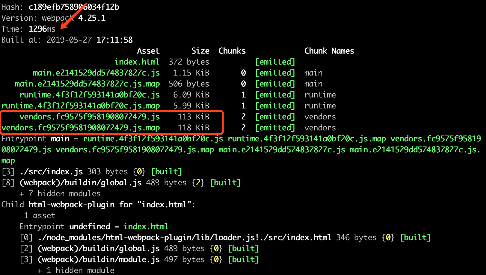
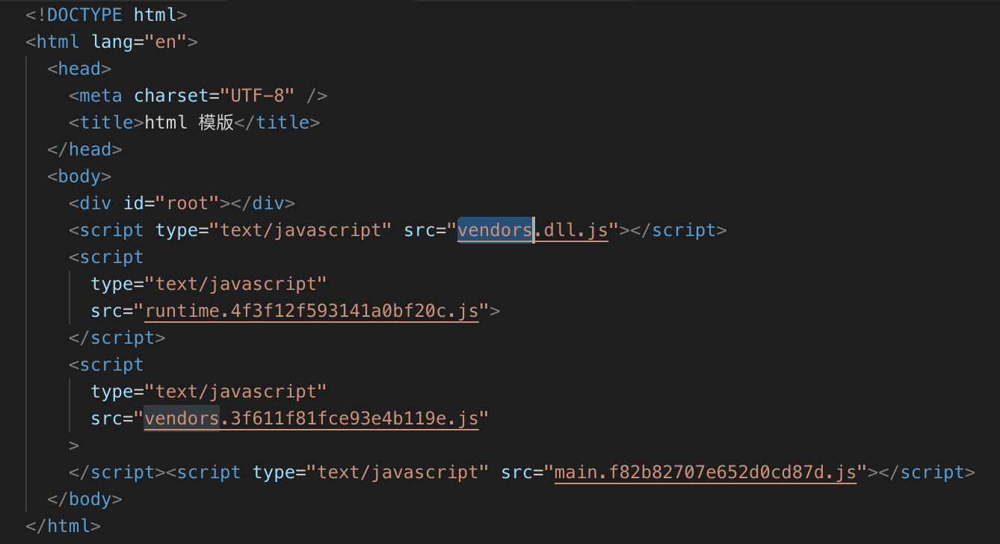
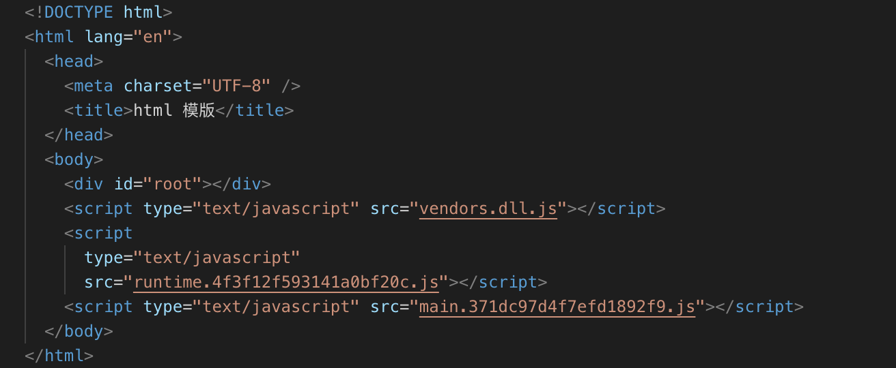

# webpack advanced 进阶

## 打包自定义库

我们准备创建一个自己写的库名为`library`。

初始化

```bash
npm init -y
npm install webpack webpack-cli --save
```

写库的内容：

```js
// src/index.js
import * as math from "./math";
import * as string from "./string";

export default { math, string };
```

```js
// src/math.js
export function add(a, b) {
  return a + b;
}
export function minus(a, b) {
  return a - b;
}
export function multiply(a, b) {
  return a * b;
}
export function division(a, b) {
  return a / b;
}
```

```js
// src/string.js
import _ from "lodash";
export function join(a, b) {
  return _.join([a, b], " ");
}
```

假如我们写的库想要别人可以通过以下方式去引入：

```js
// ESmodule
import library from "library";

// CommonJS方式
const library = require("library");

// AMD方式
require(["library"], function() {});
```

可以添加`output.libraryTarget`为`umd`(通用模块定义)，这样就可以正确引入该库。

但是假如想通过`<script>`标签来使用的话，

```html
<script src="library.js"></script>
<script>
  const math = library.math;
</script>
```

可以添加`output.library`为`library`，这样会在全局变量`window`下注入一个`library`对象，内容就是这个库导出的内容。

我们来看看配置项：

```js
// webpack.config.js
const path = require("path");

module.exports = {
  mode: "production",
  entry: "./src/index.js",
  // 忽略lodash，不要把lodash打包到自己的库中
  externals: "lodash",
  output: {
    path: path.resolve(__dirname, "dist"),
    filename: "library.js",
    library: "root",
    libraryTarget: "umd"
  }
};
```

假如设置`library: 'library',`，`libraryTarget: 'this'`，那 ESmodule、CommonJS、AMD 方式就不可以使用了，在浏览器中访问`this.library`会访问到`library`对象。

另外，做好这个库后，假如想发布到 npm 上，可以去注册 npm 账户，然后修改自己的`package.json`文件。

其中`main`是别人使用你的这个库的时候的入口文件，也就是我打包好后的文件入口。

```json
// package.json
{
  "name": "library-yourname",
  "version": "1.0.0",
  "description": "",
  "main": "./dist/library.js",
  "scripts": {
    "build": "webpack"
  },
  "keywords": [],
  "author": "yourname",
  "license": "MIT",
  "dependencies": {
    "lodash": "^4.17.11",
    "webpack": "^4.27.1",
    "webpack-cli": "^3.1.2"
  }
}
```

然后在这个库的目录下添加用户，执行`npm publish`命令，就会被发布到 npm 仓库上了。

```bash
npm adduser
npm publish
```

## PWA 的打包简单配置

PWA: Progressive Web Apps

可以利用[workbox-webpack-plugin](https://github.com/GoogleChrome/workbox)来实现。

跟着[webpack pwa](https://webpack.js.org/guides/progressive-web-application/)教程配置即可。

## proxy 和 historyApiFallback

### Proxy

详细参考：[devServer Proxy](https://webpack.js.org/configuration/dev-server#devserverproxy)

```js
// webpack.config.js
module.exports = {
  //...
  devServer: {
    proxy: {
      "/react/api": {
        // 将target代理到localhost
        target: "https://www.dell-lee.com",
        // 开启https请求
        secure: false,
        // pathRewrite
        // 假如请求 https://www.dell-lee.com/react/api/header.json
        // 会重写路径为请求 https://www.dell-lee.com/react/api/demo.json 的资源
        pathRewrite: {
          "header.json": "demo.json"
        },
        // 设置Origin更变，以绕过服务端的限制
        changeOrigin: true,
        // 请求头信息添加
        headers: {
          host: "www.dell-lee.com",
          cookie: "a=b"
        },
        // 拦截器
        bypass: function(req, res, proxyOptions) {
          if (req.headers.accept.indexOf("html") !== -1) {
            console.log("Skipping proxy for browser request.");
            return "/index.html";
          }
        }
      }
    }
  }
};
```

`proxy`的更多配置项可以查看这里：[http-proxy-middleware](https://github.com/chimurai/http-proxy-middleware)

### historyApiFallback

详细配置：[historyApiFallback](https://webpack.js.org/configuration/dev-server#devserverhistoryapifallback)

```jsx
import React, { Component } from "react";
import { BrowserRouter, Route } from "react-router-dom";
import ReactDom from "react-dom";
import Home from "./home.js";
import List from "./list.js";

class App extends Component {
  render() {
    return (
      <BrowserRouter>
        <div>
          <Route path="/" exact component={Home} />
          <Route path="/list" exact component={List} />
        </div>
      </BrowserRouter>
    );
  }
}

ReactDom.render(<App />, document.getElementById("root"));
```

本地开发在做路由跳转的时候，当我们访问`localhost:8080/list`时，可能返回的是空白页，而不是`List`组件。

因为当我们访问`localhost:8080/list`时，浏览器会默认根目录下有`list.html`文件，直接去访问`list.html`文件，所以肯定是返回空白页的。那我们想让单页应用的路由正常访问，需要配置`historyApiFallback`，这只在本地开发环境有效，线上要支持的话需要服务器支持。（其实这就是`history模式`，本地假如使用`hash模式`，路由访问就不会有这种问题）

```js
// webpack.config.js
module.exports = {
  //...
  devServer: {
    // 默认配置
    historyApiFallback: true,
    // 或者自定义重定向跳转
    historyApiFallback: {
      rewrites: [
        { from: /^\/$/, to: "/views/landing.html" },
        { from: /^\/subpage/, to: "/views/subpage.html" },
        { from: /./, to: "/views/404.html" }
        { from: "/hehe.html", to: "/views/404.html" }
      ]
    }
  }
};
```

当我们设置了`historyApiFallback: true`后，访问`localhost:8080/list`，就会正常显示`List`组件的内容了。原因是因为设置`true`后，相当于访问所有地址都从定向到`/index.html`下，然后再从里头进行路由判断，渲染出对应的组件显示。

另外，

```js
historyApiFallback: true;
```

等价于

```js
historyApiFallback: {
  rewrites: [
    {
      from: /\.*/,
      to: "/index.html"
    }
  ];
}
```

## ESlint

安装

```bash
npm i eslint -D
```

初始化配置文件，根据问答选择。

```bash
npx eslint --init
```

不想写了。。。讨厌 ESlint，去下个`eslint-loader`。

## 通过DLL加快打包速度
Dynamic-link library，缩写为`DLL`。

参考文档：[dll-plugin](https://webpack.js.org/plugins/dll-plugin/)

运行`npm run build`，看看打包时间，关注下几个指标。


打包耗时`Time: 1296ms`，因为我们配置了`splitChunks`，这会将位于`node_modules`文件夹下的被引用到的第三方模块都打包到`vendors.[contenthash].js`文件中，每次执行打包命令都会将这些第三方模板重新分析打包一遍，那我们能否在这里做优化呢？

当然，第三方模块代码基本不会变动，没有必要每次都打包它们，只需要单独抽离，在第一次打包好后，之后的调用都用第一次打包好的第三方模块文件即可。我们称它们为dll文件。

例如下面这样的引用：
```js
import React, { Component } from "react";
import ReactDom from "react-dom";
import _ from "lodash";

class App extends Component {
  render() {
    return (
      <div>
        <div>{_.join(["This", "is", "App"], " ")}</div>
      </div>
    );
  }
}

ReactDom.render(<App />, document.getElementById("root"));
```

我们引用了`react`和`react-dom`，以及`lodash`，下面我们来优化对第三方库的打包流程。

### 优化第一步

首先，创建一个`webpack.dll.js`文件，把第三方模块单独达到打包到一个dll文件夹下。
```js
// webpack.dll.js
const path = require('path');

module.exports = {
	mode: 'production',
	entry: {
		vendors: ['lodash','react', 'react-dom'],
	},
	output: {
    // 命名、将vendors模块中的模块都打包为一个vendors.dll.js文件
    filename: '[name].dll.js',
    // 打包到dll文件夹下
    path: path.resolve(__dirname, '../dll'),
    // 暴露到全局变量中，
		library: '[name]'
	}
}
```
新增一条script打包命令：
```bash
"build:dll": "webpack --config ./build/webpack.dll.js"
```

我们做到了把第三方模块抽离出来打包到dll文件夹中，并且集合为一个`vendors.dll.js`，然后我们需要在生成的html文件引用`vendors.dll.js`文件。这需要借助插件`add-asset-html-webpack-plugin`。

[add-asset-html-webpack-plugin](https://www.npmjs.com/package/add-asset-html-webpack-plugin) :Add a JavaScript or CSS asset to the HTML generated by `html-webpack-plugin`

这个插件可以往生成的HTML文件上添加新的静态资源。然后我们来添加这个插件的配置：
```js
// webpack.common.js
module.exports = {
...
  plugins: [
    new HtmlWebpackPlugin({
      template: "src/index.html"
    }),
    new CleanWebpackPlugin(["dist"], {
      root: path.resolve(__dirname, "../")
    }),
    new AddAssetHtmlWebpackPlugin({
      filepath: path.resolve(__dirname, "../dll/vendors.dll.js")
    })
  ],
...
}
```

`npm run build`打包，看生成的HTML文件：


这样就可以在`HtmlWebpackPlugin`生成的HTML文件基础上，通过`AddAssetHtmlWebpackPlugin`重新追加将`vendors.dll.js`也引入HTML文件中。

但是也能看到，这个文件中不仅是引入了我们打包好的dll文件，还引用了原先在`node_modules`中的第三方模块生成的vendors，接下来就是要继续配置，使得我们在import`react-dom`、`react`、`lodash`时，直接去使用我们打包好的`vendors.dll.js`文件，而不是还去`node_modules`引用。

### 优化第二步

下面我们来进行dll文件的配置，添加`webpack.DllPlugin`：
```js
// webpack.dll.js
const path = require('path');
const webpack = require('webpack');

module.exports = {
...
	plugins: [
    // 添加映射条件
		new webpack.DllPlugin({
      // 要分析的模块的名字，也就是我们在library里配置暴露在全局中的变量名
      name: '[name]',
      // 分析出来的manifest.json映射文件的存放位置
			path: path.resolve(__dirname, '../dll/[name].manifest.json'),
		})
	]
}
```

分析出来json文件后，要在打包配置中添加`webpack.DllReferencePlugin`，导入这个json文件来分析第三方模块的对应关系。

```js
// webpack.common.js
module.exports = {
...
  plugins: [
    new HtmlWebpackPlugin({
      template: "src/index.html"
    }),
    new CleanWebpackPlugin(["dist"], {
      root: path.resolve(__dirname, "../")
    }),
    new AddAssetHtmlWebpackPlugin({
      filepath: path.resolve(__dirname, "../dll/vendors.dll.js")
    }),
    new webpack.DllReferencePlugin({
      manifest: path.resolve(__dirname, '../dll/vendors.manifest.json')
    })
  ],
...
}
```

现在打包出来的结构目录如下：


并且我们可以看到这时候只会引入在dll文件夹下的dll文件了。


### 优化第三步

但这种写法不够灵活，要一个一个手动导入文件。


## 多入口多页面打包配置
实现配置多入口js文件，输出多个出口html文件，并且分别将入口文件打包到对应的出口文件中。
```js
module.exports = {
  entry: {
    main: "./src/index.js",
    list: "./src/list.js",
  },
}
```

输出多个html文件，无非就是使用多个`new HtmlWebpackPlugin()`生成对应的html文件。

```js
plugins:[
  new HtmlWebpackPlugin({
    template: "src/index.html",
    filename: "main.html",
    chunks: ["runtime", "vendors", "main"]
  }),
    new HtmlWebpackPlugin({
    template: "src/index.html",
    filename: "list.html",
    chunks: ["runtime", "vendors", "list"]
  })
]
```

```js
// webpack.common.js
const path = require("path");
const fs = require("fs");
const HtmlWebpackPlugin = require("html-webpack-plugin");
const CleanWebpackPlugin = require("clean-webpack-plugin");
const AddAssetHtmlWebpackPlugin = require("add-asset-html-webpack-plugin");
const webpack = require("webpack");

const makePlugins = configs => {
  const plugins = [
    new CleanWebpackPlugin(["dist"], {
      root: path.resolve(__dirname, "../")
    })
  ];
  Object.keys(configs.entry).forEach(item => {
    plugins.push(
      new HtmlWebpackPlugin({
        template: "src/index.html",
        filename: `${item}.html`,
        chunks: ["runtime", "vendors", item]
      })
    );
  });
  // 遍历dll文件夹下的所有文件，files是一个数组，里面存放文件名们。
  const files = fs.readdirSync(path.resolve(__dirname, "../dll"));
  files.forEach(file => {
    if (/.*\.dll.js/.test(file)) {
      plugins.push(
        // 往对应的Html上添加新的js文件
        new AddAssetHtmlWebpackPlugin({
          filepath: path.resolve(__dirname, "../dll", file)
        })
      );
    }
    if (/.*\.manifest.json/.test(file)) {
      plugins.push(
        new webpack.DllReferencePlugin({
          manifest: path.resolve(__dirname, "../dll", file)
        })
      );
    }
  });
  return plugins;
};

const configs = {
  entry: {
    index: "./src/index.js",
    list: "./src/list.js",
    detail: "./src/detail.js"
  },
  resolve: {
    extensions: [".js", ".jsx"]
  },
  module: {
    rules: [
      {
        test: /\.jsx?$/,
        include: path.resolve(__dirname, "../src"),
        use: [
          {
            loader: "babel-loader"
          }
        ]
      },
      {
        test: /\.(jpg|png|gif)$/,
        use: {
          loader: "url-loader",
          options: {
            name: "[name]_[hash].[ext]",
            outputPath: "images/",
            limit: 10240
          }
        }
      },
      {
        test: /\.(eot|ttf|svg)$/,
        use: {
          loader: "file-loader"
        }
      }
    ]
  },
  optimization: {
    runtimeChunk: {
      name: "runtime"
    },
    usedExports: true,
    splitChunks: {
      chunks: "all",
      cacheGroups: {
        vendors: {
          test: /[\\/]node_modules[\\/]/,
          priority: -10,
          name: "vendors"
        }
      }
    }
  },
  performance: false,
  output: {
    path: path.resolve(__dirname, "../dist")
  }
};

configs.plugins = makePlugins(configs);

module.exports = configs;
```

```js
// webpack.dev.js
const webpack = require("webpack");
const merge = require("webpack-merge");
const commonConfig = require("./webpack.common.js");

const devConfig = {
  mode: "development",
  devtool: "cheap-module-eval-source-map",
  devServer: {
    contentBase: "./dist",
    open: true,
    port: 8080,
    hot: true
  },
  module: {
    rules: [
      {
        test: /\.scss$/,
        use: [
          "style-loader",
          {
            loader: "css-loader",
            options: {
              importLoaders: 2
            }
          },
          "sass-loader",
          "postcss-loader"
        ]
      },
      {
        test: /\.css$/,
        use: ["style-loader", "css-loader", "postcss-loader"]
      }
    ]
  },
  plugins: [new webpack.HotModuleReplacementPlugin()],
  output: {
    filename: "[name].js",
    chunkFilename: "[name].js"
  }
};

module.exports = merge(commonConfig, devConfig);
```

```js
// webpack.prod.js
const MiniCssExtractPlugin = require("mini-css-extract-plugin");
const OptimizeCSSAssetsPlugin = require("optimize-css-assets-webpack-plugin");
const merge = require("webpack-merge");
const commonConfig = require("./webpack.common.js");

const prodConfig = {
  mode: "production",
  devtool: "cheap-module-source-map",
  module: {
    rules: [
      {
        test: /\.scss$/,
        use: [
          MiniCssExtractPlugin.loader,
          {
            loader: "css-loader",
            options: {
              importLoaders: 2
            }
          },
          "sass-loader",
          "postcss-loader"
        ]
      },
      {
        test: /\.css$/,
        use: [MiniCssExtractPlugin.loader, "css-loader", "postcss-loader"]
      }
    ]
  },
  optimization: {
    minimizer: [new OptimizeCSSAssetsPlugin({})]
  },
  plugins: [
    new MiniCssExtractPlugin({
      filename: "[name].css",
      chunkFilename: "[name].chunk.css"
    })
  ],
  output: {
    filename: "[name].[contenthash].js",
    chunkFilename: "[name].[contenthash].js"
  }
};

module.exports = merge(commonConfig, prodConfig);
```