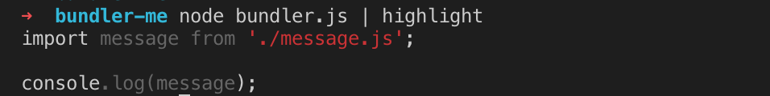

# webpack advanced 原理分析

[toc]

## 编写一个 Loader

Loader 的本质就只是一个函数，拿到源代码 source 对象，然后再返回处理后的 source 对象。

初始化一个项目

```js
npm init -y
npm i webpack webpack-cli -D
```

我们来实现一个替换文字内容的 loader。

定义 loader 内容，其实就是导出一个函数，但注意这个函数不能写成箭头函数的形式，因为后面我们要用到它的`this`的内容。

```js
// /loaders/replaceLoader.js
// source就是引入文件的源代码/内容
module.exports = function(source) {
  // this.query 中是 loader 的 options 传来的参数，下面webpack配置可以看到。
  console.log(this.query); // 输出：{name: Du}
  // 将内容里的'world'换成'Du'
  return source.replace("world", "Du");
};
```

一个最简单的 Loader 便写完了，那如何去使用这个 Loader 呢？

我们来配置`webpack.config.js`文件，只需要在`module.rules`中声明就好。

```js
// /webpack.config.js
const path = require("path");
module.exports = {
  mode: "development",
  entry: {
    main: "./src/index.js"
  },
  module: {
    rules: [
      {
        test: /\.js/,
        use: [
          {
            // 使用的loader的路径
            loader: path.resolve(__dirname, "./loaders/replaceLoader.js"),
            options: {
              // 这里面可以自定义要传递过去的参数
              name: "Du"
            }
          }
        ]
      }
    ]
  },
  output: {
    path: path.resolve(__dirname, "dist"),
    filename: "[name].js"
  }
};
```

这样就实现了一个最简单的 Loader。

### this.query

关于`this.query`这个参数的说明，我们还可以查询官方的 api 文档，这里除了 query 以外，还有很多可供选择的 api 可用。

[点击查看 loaders API](https://webpack.js.org/api/loaders#thisquery)

例如在传递的参数这里，官方推荐使用[loaderUtils](https://github.com/webpack/loader-utils#getoptions)的`getOptions`方法来解析传递过来的参数。

```js
// /loaders/replaceLoader.js
const loaderUtils = require("loader-utils");
module.exports = function(source) {
  // 使用getOptions可以直接拿到options传过来的参数
  const options = loaderUtils.getOptions(this);
  return source.replace("world", options.name);
};
```

### this.callback

再解释一个很常用的参数：`this.callback`，官方解释 A function that can be called synchronously or asynchronously in order to return multiple results.

使用这个 callback 我们可以 return 回更多不同的结果。

```js
this.callback(
  err: Error | null,
  content: string | Buffer,
  sourceMap?: SourceMap,
  meta?: any
);
```

其中 meta 可以是任何内容，我们套用进我们的代码中，忽略掉 meta 和 sourceMap 参数：

```js
// /loaders/replaceLoader.js
const loaderUtils = require("loader-utils");
module.exports = function(source) {
  // 使用getOptions可以直接拿到options传过来的参数
  const options = loaderUtils.getOptions(this);
  const result = source.replace("world", options.name);
  this.callback(null, result);
};
```

### this.async

> Tells the loader-runner that the loader intends to call back asynchronously. Returns this.callback.

当我们希望在 Loader 中异步调用后再返回结果，这个时候就需要用到`this.async`。

```js
// /loaders/replaceLoader.js
const loaderUtils = require("loader-utils");
module.exports = function(source) {
  const options = loaderUtils.getOptions(this);
  // 声明this.async()
  const callback = this.async();

  setTimeout(() => {
    const result = source.replace("world", options.name);
    // 使用this.async()，其实就是返回一个this.callback()
    callback(null, result);
  }, 1000);
};
```

### 多个 Loader 叠加使用

就和平时多个 Loader 一样叠加即可。

```js
// /webpack.config.js
const path = require("path");
module.exports = {
...
  module: {
    rules: [
      {
        test: /\.js/,
        use: [
          {
            loader: path.resolve(__dirname, "./loaders/replaceLoader.js"),
          },
          {
            loader: path.resolve(__dirname, "./loaders/replaceLoader-2.js"),
            options: {
              name: "Du"
            }
          }
        ]
      }
    ]
  },
...
};
```

通过`resolveLoader`，优化`loader`的引用路径。

```js
// /webpack.config.js
const path = require("path");
module.exports = {
...
  resolveLoader: {
    modules: ["node_modules", "./loaders"]
  },
  module: {
    rules: [
      {
        test: /\.js/,
        use: [
          {
            loader: "replaceLoader"
          },
          {
            loader: "replaceLoaderAsync",
            options: {
              name: "lee"
            }
          }
        ]
      }
    ]
  },
...
};
```

## 编写一个 Plugin

Plugin 和 Loader 的区别个人理解：Loader 用来处理类似于 js/css/font/svg/img 等等等文件，而 Plugin 是在打包的某一个时刻（打包前、打包时、打包后）来额外做某些事情。

webpack Plugin 设计模式：发布订阅，事件驱动模式。

我们下面编写的这个 Plugin 要做的事情：**打包结束后在 dist 目录添加一个版权信息的 txt 文件。**

插件的本质是一个 Class。

第一步，声明一个插件文件：

```js
// /plugins/copyright-webpack-plugin.js
class CopyrightWebpackPlugin {
  // 使用插件的时候，会去调用apply方法，其中的compiler是webpack的实例对象。
  apply(compiler) {
    // compiler.hooks.compile.tap('CopyrightWebpackPlugin', (compilation) => {
    // 	console.log('compiler');
    // })
    // compiler.hooks.emit.tapAsync('CopyrightWebpackPlugin', (compilation, cb) => {
    // 	debugger;
    // 	compilation.assets['copyright.txt']= {
    // 		source: function() {
    // 			return 'copyright by dell lee'
    // 		},
    // 		size: function() {
    // 			return 21;
    // 		}
    // 	};
    // 	cb();
    // })
  }
}
module.exports = CopyrightWebpackPlugin;
```

第二步，在`webpack.config.js`中使用它：

```js
// /webpack.config.js
const path = require("path");
const CopyRightWebpackPlugin = require("./plugins/copyright-webpack-plugin");
module.exports = {
  mode: "development",
  entry: {
    main: "./src/index.js"
  },
  plugins: [new CopyRightWebpackPlugin()],
  output: {
    path: path.resolve(__dirname, "dist"),
    filename: "[name].js"
  }
};
```

这一下明白了为什么在使用 Plugins 时，总是要 new 一个实例，因为 Plugin 导出的就是一个 Class。

想接收参数，那就在`constructor`中接收`options`来使用：

```js
module.exports = {
	...
	plugins: [
		new CopyRightWebpackPlugin({
			name: 'du'
		})
	],
	...
}
```

```js
// /plugins/copyright-webpack-plugin.js
class CopyrightWebpackPlugin {
  constructor(options) {
    console.log(options); // {name:'du'}
  }
  apply(compiler) {
    // do something
  }
}
module.exports = CopyrightWebpackPlugin;
```

钩子执行的时刻说明：[compiler-hooks](https://webpack.js.org/api/compiler-hooks)

例如`emit`：Executed right before emitting assets to output dir.(打包好准备把文件放到输出目录的时刻)
它是一个 AsyncSeriesHook（异步钩子），所以要使用`tapAsync`。

`compilation`里存储着这次打包的所有内容。可以打印输出`compilation.assets`，是一个对象。

```js
class CopyrightWebpackPlugin {
  apply(compiler) {
    // 同步的时刻
    compiler.hooks.compile.tap("CopyrightWebpackPlugin", compilation => {
      console.log("compiler");
    });

    // 异步的时刻
    compiler.hooks.emit.tapAsync(
      "CopyrightWebpackPlugin",
      (compilation, cb) => {
        // 在compilation中新增一个txt文件
        compilation.assets["copyright.txt"] = {
          // 文件的内容
          source: function() {
            return "copyright by dell lee";
          },
          // 这个文件的大小长度是21个字节
          size: function() {
            return 21;
          }
        };
        // 用了异步的tapAsync，最后一定要执行一下cb()
        cb();
      }
    );
  }
}
module.exports = CopyrightWebpackPlugin;
```

这样就完成了我们要往打包文件中添加一个 txt 文件的需求。

## 编写一个 Bundler

下面我们来自己实现一个简易的打包工具(Bundler)

### 模块分析-初始化

首先是项目的目录结构创建。

```bash
npm init -y
```

在`src`下创建三个文件：

```js
// /src/word.js
export const word = "hello";
```

```js
// /src/message.js
import { word } from "./word.js";
const message = `say ${word}`;
export default message;
```

```js
// /src/index.js
import message from "./message.js";
console.log(message);
```

然后再创建打包配置文件`bundler.js`，在这里我们使用`fs`模块来读取入口文件的内容。

```js
// /src/bundler.js
const fs = require("fs");
const moduleAnalyser = filename => {
  const content = fs.readFileSync(filename, "utf-8");
  console.log(content);
};
moduleAnalyser("./src/index.js");
```

想要控制台输出代码高亮的话，可以使用`cli-highlight`

```bash
npm i cli-highlight -g
```

运行我们的代码，代码高亮打印输出`content`：

```bash
node bundler.js | highlight
```



`content`就是我们引入的`'./src/index.js'`的内容。

### 模块分析-多入口文件依赖

上面只引入了一个模块，能比较方便的获取文件的内容，假如入口文件引入了很多模块，那怎么获取到这些文件的所有依赖？

我们可以安装使用`babel`的[@babel-parser](https://babeljs.io/docs/en/babel-parser)，这个会把 JS 文件解析为抽象语法树，然后我们再进行分析。

```js
// /src/bundler.js
const fs = require("fs");
const parser = require("@babel/parser");

const moduleAnalyser = filename => {
  const content = fs.readFileSync(filename, "utf-8");
  console.log(
    parser.parse(content, {
      // ES6模式sourceType用module
      sourceType: "module"
    })
  );
};
moduleAnalyser("./src/index.js");
```


我们可以看到`babel-parser`把`content`内容解析成了抽象语法树，我们继续对这个抽象语法树的节点进行展开，打印`ast.program.body`：

```js
const ast = parser.parse(content, {
  sourceType: "module"
});
console.log(ast.program.body);
```


假如我们多引入一个模块，那输出的内容中会多出一个`type: 'ImportDeclaration'`的 Node 节点。例如我们多引入一个 message1：

```js
// /src/index.js
import message from "./message.js";
import message1 from "./message1.js";

console.log(message);
```

那`ast.program.body`输出的内容就变成：


可以看到，多出了一个`type: 'ImportDeclaration`的节点。

遍历每个引入节点有些麻烦，babel 提供了插件[babel-traverse](https://babeljs.io/docs/en/babel-traverse)来做这件事。

安装`npm install --save @babel/traverse`，然后配合着`parse`一块解析模块：

```js
// /src/bundler.js
const fs = require("fs");
const path = require("path");
const parser = require("@babel/parser");
// ES6默认导出的export default，所以这里要加 .default
const traverse = require("@babel/traverse").default;

const moduleAnalyser = filename => {
  const content = fs.readFileSync(filename, "utf-8");
  const ast = parser.parse(content, {
    sourceType: "module"
  });
  // 声明一个依赖数组
  const dependencies = [];
  // traverse接收第一个参数是抽象语法树对象
  traverse(ast, {
    // 筛选出ImportDeclaration类型的节点，然后遍历
    ImportDeclaration({ node }) {
      // dirname 是 filename 的路径地址
      const dirname = path.dirname(filename); // dirname: ./src
      // 拼接路径
      // node.source.value就是文件名的值，可以看上面打印输出的内容来取值
      const newFile = "./" + path.join(dirname, node.source.value);
      dependencies.push(newFile);
    }
  });
  console.log("dependencies:", dependencies);
};
moduleAnalyser("./src/index.js");
```

打印出来的 dependencies 是`dependencies: [ './src/message.js', './src/message1.js' ]`。

但是这样的`dependencies`还不够灵活，因为数组中只有文件的绝对路径，我们来进行改进，让`dependencies`中，保存文件的相对路径和绝对路径。

```js
// /src/bundler.js
...
	const dependencies = {};
  traverse(ast, {
    ImportDeclaration({node}) {
	  const dirname = path.dirname(filename);
      const newFile = "./" + path.join(dirname, node.source.value);
      // -- dependencies.push(newFile);
      // 以对象的形式存放
			++ dependencies[node.source.value] = newFile;
    }
  });
  console.log(dependencies);
  ...
```

输出的`dependencies`，键是相对路径，值是绝对路径：


### 模块分析-编译入口文件代码

截止目前，我们已经获取了入口文件的所有的依赖，但是这还不够，我们还需要将原始的代码，打包成可以在浏览器上可运行的编译后的代码。

我们借助[@babel/core](https://babeljs.io/docs/en/babel-core)来做这个转化，babel 提供了`transformFromAst`方法，这个方法可以把抽象语法树(ast)转化为浏览器可执行的代码。

安装`@babel/core`，以及`@babel/preset-env`，babel 需要借助`@babel/preset-env`来进行编译转化。

```bash
npm i @babel/core @babel/preset-env --save
```

```js
// /src/bundler.js
const babel = require('@babel/core');
...
	const dependencies = {};
  traverse(ast, {
    ImportDeclaration({node}) {
	  const dirname = path.dirname(filename);
      const newFile = "./" + path.join(dirname, node.source.value);
			dependencies[node.source.value] = newFile;
    }
  });
  // AST转化为可执行代码
  const { code } = babel.transformFromAst(ast, null, {
		presets: ["@babel/preset-env"]
	});
  console.log(code);
  ...
```

`babel.transformFromAst`返回的对象中有个`code`对象，这个对象就是编译好后的文件内容，我们打印它出来看看：


可以看到这就是编译后的 ES5 的代码了，那我们模块分析这块的内容就完成了，我们完成了对入口文件的分析，下面是完整的`/src/bundler.js`文件：

```js
// /src/bundler.js
const fs = require("fs");
const path = require("path");
const parser = require("@babel/parser");
const traverse = require("@babel/traverse").default;
const babel = require("@babel/core");

const moduleAnalyser = filename => {
  const content = fs.readFileSync(filename, "utf-8");
  const ast = parser.parse(content, {
    sourceType: "module"
  });
  const dependencies = {};
  traverse(ast, {
    ImportDeclaration({ node }) {
      const dirname = path.dirname(filename);
      const newFile = "./" + path.join(dirname, node.source.value);
      dependencies[node.source.value] = newFile;
    }
  });
  const { code } = babel.transformFromAst(ast, null, {
    presets: ["@babel/preset-env"]
  });
  return {
    filename,
    dependencies,
    code
  };
};
const moduleInfo = moduleAnalyser("./src/index.js");
console.log(moduleInfo);
```

打印`moduleInfo`，导出的对象里的三个值：


### Dependencies Graph

我们上面只分析了入口文件，只是最外面的一层，但入口文件中引入的文件还没有分析，下面我们要进行这一步，递归地分析入口文件中的引用，为之后代码的生成做准备。

在之前的代码基础上，我们去掉在`index.js`中对`message1.js`的引用，`index.js`引用`message.js`，`message.js`内再引用`word.js`.

通过队列的方式来实现一个递归的效果，我们实现一个`makeDependenciesGraph`函数：

```js
// /src/bundler.js
// ...
// 省略引入的模块
const moduleAnalyser = filename => {
  // ...
  // 省略moduleAnalyser函数内容
  return {
    filename,
    dependencies,
    code
  };
};
const makeDependenciesGraph = entry => {
  const entryModule = moduleAnalyser(entry);
  console.log("entryModule: ", entryModule);
  const graphArray = [entryModule];
  console.log("graphArray遍历前: ", graphArray);
  // 对graphArray遍历
  for (let i = 0; i < graphArray.length; i++) {
    const item = graphArray[i];
    // 取出对象中的依赖
    const { dependencies } = item;
    // 有存在依赖则再执行一次moduleAnalyser，并且push到graphArray中
    // 假设是第一次执行，graphArray长度为1，
    // 那push后，graphArray的长度为2，就会继续遍历graphArray中刚push进来的dependencies文件
    if (dependencies) {
      for (let j in dependencies) {
        graphArray.push(moduleAnalyser(dependencies[j]));
      }
    }
  }
  console.log("graphArray遍历完后: ", graphArray);

  // 创建一个graph对象，包装这个对象来做后续使用
  const graph = {};
  graphArray.forEach(item => {
    graph[item.filename] = {
      dependencies: item.dependencies,
      code: item.code
    };
  });
  return graph;
};

const graghInfo = makeDependenciesGraph("./src/index.js");
console.log("包装后的graghInfo:", graghInfo);
```

下面我们来看输出，可以看到`entryModule`对象，就是`moduleAnalyser()`返回的结果：


然后再看遍历前后`graphArray`的两次输出，第一次数组里只有一个对象，第二次数组里有三个对象：


最后看看包装后的`graghInfo`（依赖树），也就是最终我们期待的对象，键是文件名称，值是`dependencies`和`code`：


### 生成代码

现在我们已经拿到对所有代码模块分析生成的结果（Dependencies Graph 依赖图谱），就是上述的`graghInfo`对象。最后我们需要输出生成一份打包后的代码，使其可以直接在浏览器运行。

为了避免污染全局环境，代码要使用 IIFE 中执行（闭包环境）。

我们构造一个函数，使其输出最后我们所需的打包后的 code：

```js
// /src/bundler.js
// ... 省略上方
const generateCode = entry => {
  const graph = makeDependenciesGraph(entry);
  return `
  (function(graph){

  })(${graph})
  `;
};
// -- const graghInfo = makeDependenciesGraph('./src/index.js');
const code = generateCode("./src/index.js");
console.log("code:", code);
```

输出 code：

```js
code:
  (function(graph){

  })([object Object])
```

这编译后的代码不对，因为上面的`${graph}`是个对象，所以我们需要先将这个对象 stringify 后再放入字符拼接中。

```js
const generateCode = entry => {
  const graph = JSON.stringify(makeDependenciesGraph(entry));
  return `
  (function(graph){

  })(${graph})
  `;
};
```

再次输出 code：


看不清楚的话，这里有文字版：

```js
// code内容：
(function(graph) {})({
  "./src/index.js": {
    dependencies: { "./message.js": "./src/message.js" },
    code:
      '"use strict";\n\nvar _message = _interopRequireDefault(require("./message.js"));\n\nfunction _interopRequireDefault(obj) { return obj && obj.__esModule ? obj : { "default": obj }; }\n\nconsole.log(_message["default"]);'
  },
  "./src/message.js": {
    dependencies: { "./word.js": "./src/word.js" },
    code:
      '"use strict";\n\nObject.defineProperty(exports, "__esModule", {\n  value: true\n});\nexports["default"] = void 0;\n\nvar _word = require("./word.js");\n\nvar message = "say ".concat(_word.word);\nvar _default = message;\nexports["default"] = _default;'
  },
  "./src/word.js": {
    dependencies: {},
    code:
      '"use strict";\n\nObject.defineProperty(exports, "__esModule", {\n  value: true\n});\nexports.word = void 0;\nvar word = \'hello\';\nexports.word = word;'
  }
});
```

我们可以看到，如果直接把这些代码放到浏览器是运行不起来的，因为在浏览器中缺少`require()`函数和`exports`对象。如果我们直接去执行会报错，下面我们来补充它们。

首先是构造`require()`函数：

```js
const generateCode = entry => {
  const graph = JSON.stringify(makeDependenciesGraph(entry));
  return `
  (function(graph){
    function require(module) {
      (function(code){
        eval(code);
      })(graph[module].code)
    };
    require('${entry}')
  })(${graph})
  `;
};
const code = generateCode("./src/index.js");
```

但是上面的 require 函数还是有一些问题，eval() 函数会将传入的字符串当做 JavaScript 代码进行执行，我们把`eval(code)`中的`code`单独拿出来看看，也就是`graph[module].code`的内容，有三个，我们看`"./src/index.js"`的，并把这个字符串先手动转为JS高亮看：

```js
// "./src/index.js"
"use strict";\n\n
// 注意这里有一个require()
var _message = _interopRequireDefault(require("./message.js"));\n\n
function _interopRequireDefault(obj) { return obj && obj.__esModule ? obj : { "default": obj }; }\n\n
console.log(_message["default"]);
```

其中还有一个`require("./message.js")`函数，那再调用`_interopRequireDefault`方式时，它会再次调用`eval()`函数外层的`require()`方法，递归执行，也就是第二次执行的是：
```js
...
  // 第二次执行：require("./message.js")
  function require(module) {
    (function(code){
      eval(code);
    })(graph[module].code)
  };
...
```

而传入的参数`./message.js`是不对的，它会在`graph[module].code`中去寻找，即`graph['./message.js'].code`，这当然是找不到的，应该是`./src/message.js`才对。

所以我们需要对`./message.js`这样的相对路径做转换，我们再顶一个`localRequire()`函数，用于返回正确的路径。
```js
...
  // 第二次执行：require("./message.js")
  function require(module) {
    function localRequire(relativePath) {
      // 接收到的relativePath 是 "./message.js"
      // 返回require()函数的运行结果是 "./src/message.js"
      return require(graph[module].dependencies[relativePath])
    }
    (function(require, code){
      // 这样code里的require()其实就是localRequire中返回的require()，重新声明的
      eval(code);
    })(localRequire, graph[module].code)
  };
...
```

最后`Object.defineProperty(exports, 'property', {xx:xx})`，我们再定义一个`exports`空对象传入其中，生成代码便完成了。

```js
const generateCode = (entry) => {
  const graph = JSON.stringify(makeDependenciesGraph(entry));
  return `
  (function(graph){
    function require(module) { 
      function localRequire(relativePath) {
        return require(graph[module].dependencies[relativePath]);
      }
      var exports = {};
      (function(require, exports, code){
        eval(code)
      })(localRequire, exports, graph[module].code);
      return exports;
    };
    require('${entry}')
  })(${graph});
  `
}
const code = generateCode("./src/index.js");
```

我们打包后的代码可以直接拿到浏览器运行。


打包出来的内容：
```js
  (function(graph){
    function require(module) { 
      function localRequire(relativePath) {
        return require(graph[module].dependencies[relativePath]);
      }
      var exports = {};
      (function(require, exports, code){
        eval(code)
      })(localRequire, exports, graph[module].code);
      return exports;
    };
    require('./src/index.js')
  })({"./src/index.js":{"dependencies":{"./message.js":"./src/message.js"},"code":"\"use strict\";\n\nvar _message = _interopRequireDefault(require(\"./message.js\"));\n\nfunction _interopRequireDefault(obj) { return obj && obj.__esModule ? obj : { \"default\": obj }; }\n\nconsole.log(_message[\"default\"]);"},"./src/message.js":{"dependencies":{"./word.js":"./src/word.js"},"code":"\"use strict\";\n\nObject.defineProperty(exports, \"__esModule\", {\n  value: true\n});\nexports[\"default\"] = void 0;\n\nvar _word = require(\"./word.js\");\n\nvar message = \"say \".concat(_word.word);\nvar _default = message;\nexports[\"default\"] = _default;"},"./src/word.js":{"dependencies":{},"code":"\"use strict\";\n\nObject.defineProperty(exports, \"__esModule\", {\n  value: true\n});\nexports.word = void 0;\nvar word = 'hello';\nexports.word = word;"}});
```

完整的配置文件：
```js
// /src/bundler.js
const fs = require("fs");
const path = require("path");
const parser = require("@babel/parser");
const traverse = require("@babel/traverse").default;
const babel = require("@babel/core");

const moduleAnalyser = filename => {
  const content = fs.readFileSync(filename, "utf-8");
  const ast = parser.parse(content, {
    sourceType: "module"
  });
  const dependencies = {};
  traverse(ast, {
    ImportDeclaration({ node }) {
      const dirname = path.dirname(filename);
      const newFile = "./" + path.join(dirname, node.source.value);
      dependencies[node.source.value] = newFile;
    }
  });
  const { code } = babel.transformFromAst(ast, null, {
    presets: ["@babel/preset-env"]
  });
  return {
    filename,
    dependencies,
    code
  };
};

const makeDependenciesGraph = (entry) => {
  const entryModule = moduleAnalyser(entry);
  const graphArray = [ entryModule ];
	for(let i = 0; i < graphArray.length; i++) {
		const item = graphArray[i];
		const { dependencies } = item;
		if(dependencies) {
			for(let j in dependencies) {
				graphArray.push(
					moduleAnalyser(dependencies[j])
				);
			}
    }
  }
  const graph = {};
  graphArray.forEach(item => {
		graph[item.filename] = {
			dependencies: item.dependencies,
			code: item.code
		}
	});
  return graph;
}
const generateCode = (entry) => {
  const graph = JSON.stringify(makeDependenciesGraph(entry));
  return `
  (function(graph){
    function require(module) { 
      function localRequire(relativePath) {
        return require(graph[module].dependencies[relativePath]);
      }
      var exports = {};
      (function(require, exports, code){
        eval(code)
      })(localRequire, exports, graph[module].code);
      return exports;
    };
    require('${entry}')
  })(${graph});
  `
}
const code = generateCode('./src/index.js');
```

